<div align="center">
	
</div>

---

<details>
<summary><b>🗃️ Adatbázis, DBMS fogalma és jellemzői</b></summary>

| Fogalom | Leírás |
|---|---|
| **Adatbázis** | Strukturált adathalmaz, logikailag összefüggő adatok, digitális formában. |
| **Adatbázisrendszer** | Az adatbázis, DBMS, felhasználók és alkalmazások összessége. |
| **DBMS** | Szoftver, amely az adatbázisok létrehozását, karbantartását, lekérdezését, módosítását teszi lehetővé. |


Az adatbázis-kezelő rendszer (DBMS) három fő rétegre bontható: fizikai réteg (adatok tényleges tárolása, pl. merevlemez, SSD, cloud storage, RAID, backup), logikai réteg (adatok szerkezete, séma, logikai kapcsolatok, indexek, nézetek, triggerek), kezelői réteg (felhasználói felület, lekérdezések, alkalmazások, API-k, CLI, GUI). A DBMS fő feladatai: adatintegritás biztosítása, többfelhasználós hozzáférés, adatbiztonság, tranzakciókezelés (ACID), adatmentés és visszaállítás, indexelés és optimalizálás, adatkonzisztencia fenntartása, auditálás, naplózás, adatmodellezés támogatása, jogosultságkezelés, szerepkörök, teljesítményhangolás, kapcsolatok, referenciális integritás.

**DBMS fő feladatai:**
	- Adatintegritás biztosítása
	- Többfelhasználós hozzáférés
	- Adatbiztonság
	- Tranzakciókezelés (ACID)
	- Adatmentés és visszaállítás
	- Indexelés és optimalizálás
	- Adatkonzisztencia fenntartása
	- Auditálás, naplózás
	- Adatmodellezés támogatása
	- Jogosultságkezelés, szerepkörök
	- Teljesítményhangolás
	- Kapcsolatok, referenciális integritás

**ACID tulajdonságok:**
	- **Atomicitás:** Egy tranzakció vagy teljesen végrehajtódik, vagy egyáltalán nem (pl. pénzátutalásnál mindkét számla módosul, vagy egyik sem).
	- **Konzisztencia:** A tranzakció után az adatbázis konzisztens állapotban marad, nem sérülnek az integritási szabályok.
	- **Izoláció:** A párhuzamos tranzakciók nem zavarják egymást, pl. két felhasználó egyszerre módosít, de nem keverednek az adatok.
	- **Tartósság:** A végrehajtott tranzakciók eredménye megmarad rendszerhiba után is, pl. mentés, naplózás.

**Ábra: DBMS rétegek**
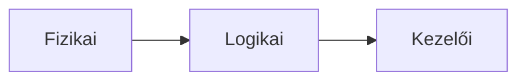


Az ACID tulajdonságok: atomicitás (egy tranzakció vagy teljesen végrehajtódik, vagy egyáltalán nem, pl. pénzátutalásnál mindkét számla módosul, vagy egyik sem), konzisztencia (a tranzakció után az adatbázis konzisztens állapotban marad, nem sérülnek az integritási szabályok), izoláció (a párhuzamos tranzakciók nem zavarják egymást, pl. két felhasználó egyszerre módosít, de nem keverednek az adatok), tartósság (a végrehajtott tranzakciók eredménye megmarad rendszerhiba után is, pl. mentés, naplózás). Tranzakciók csoportos műveletek, amelyek vagy teljesen végrehajtódnak, vagy visszagörgetődnek (rollback). Tipikus hibák: adatvesztés (nincs mentés, backup hiánya, hardverhiba), ütközés (párhuzamos módosítások, lockolás hiánya, deadlock), jogosultsági hiba (nem megfelelő hozzáférés, túl széles jogok, privilege escalation), integritási hiba (sérült kulcsok, duplikált rekordok, árva rekordok), teljesítményprobléma (nem optimalizált indexek, lassú lekérdezések). Best practice: rendszeres backup, tesztelt visszaállítás, megfelelő indexek, optimalizált lekérdezések, ACID elvek betartása, jogosultságok szabályozása, auditálás, teljesítmény monitorozása. Vizsgatipp: mindig említsd az ACID tulajdonságokat, és hogy miért fontosak, rajzolj architektúra diagramot, mutasd be a rétegeket, példákkal illusztráld a tipikus hibákat és azok elkerülését.

**Ábra: ACID**
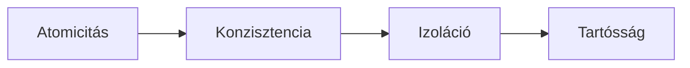
**Példa DBMS-ekre:**
<span style="color:#2ecc40">MySQL</span>, <span style="color:#e67e22">PostgreSQL</span>, <span style="color:#9b59b6">Oracle</span>, <span style="color:#0078d7">SQL Server</span>, <span style="color:#00b894">MongoDB</span>, <span style="color:#636e72">SQLite</span>

**DBMS architektúra:**
| Réteg | Leírás |
|---|---|
| Fizikai | Adatok tényleges tárolása (merevlemez, SSD, cloud storage, RAID, backup) |
| Logikai | Adatok szerkezete, séma, logikai kapcsolatok, indexek, nézetek, triggerek |
| Kezelői | Felhasználói felület, lekérdezések, alkalmazások, API-k, CLI, GUI |

---
**Részletes magyarázat, elmélet, best practice, tipikus hibák, vizsgatippek, példák:**

**Mi az adatbázis?**
- Strukturált adathalmaz, amelyet logikai összefüggések, szabályok, séma ír le. Célja az adatok biztonságos, visszakereshető, hatékony tárolása.
- Adatbázisok lehetnek relációs, objektum-orientált, NoSQL, időalapú, grafikus stb.

**Mi a DBMS?**
- Olyan szoftver, amely az adatbázisok kezelését, védelmét, elérését, módosítását, mentését, visszaállítását, optimalizálását végzi.
- Támogatja a többfelhasználós hozzáférést, jogosultságokat, auditálást, naplózást, adatkonzisztenciát.

**ACID tulajdonságok részletesen:**
- **Atomicitás:** Egy tranzakció vagy teljesen végrehajtódik, vagy egyáltalán nem. Pl. pénzátutalásnál mindkét számla módosul, vagy egyik sem.
- **Konzisztencia:** A tranzakció után az adatbázis konzisztens állapotban marad, nem sérülnek az integritási szabályok.
- **Izoláció:** A párhuzamos tranzakciók nem zavarják egymást, pl. két felhasználó egyszerre módosít, de nem keverednek az adatok.
- **Tartósság:** A végrehajtott tranzakciók eredménye megmarad rendszerhiba után is, pl. mentés, naplózás.

**Tranzakciókezelés:**
- Tranzakciók csoportos műveletek, amelyek vagy teljesen végrehajtódnak, vagy visszagörgetődnek (rollback).
- Példa: banki átutalás, készletkezelés, foglalási rendszerek.

**Tipikus hibák:**
- Adatvesztés: nincs mentés, backup hiánya, hardverhiba.
- Ütközés: párhuzamos módosítások, lockolás hiánya, deadlock.
- Jogosultsági hiba: nem megfelelő hozzáférés, túl széles jogok, privilege escalation.
- Integritási hiba: sérült kulcsok, duplikált rekordok, árva rekordok.
- Teljesítményprobléma: nem optimalizált indexek, lassú lekérdezések.

**Best practice:**
- Mindig legyen rendszeres backup, tesztelt visszaállítás.
- Használj megfelelő indexeket, optimalizáld a lekérdezéseket.
- Tartsd be az ACID elveket, különösen pénzügyi, kritikus rendszereknél.
- Szabályozd a jogosultságokat, auditáld a hozzáféréseket.
- Monitorozd a teljesítményt, naplózd a hibákat.

**Vizsgatipp:**
- Mindig említsd az ACID tulajdonságokat, és hogy miért fontosak!
- Rajzolj architektúra diagramot, mutasd be a rétegeket.
- Példákkal illusztráld a tipikus hibákat és azok elkerülését.

**Gyakorlati példa:**
```sql
BEGIN;
UPDATE szamla SET egyenleg = egyenleg - 100 WHERE id = 1;
UPDATE szamla SET egyenleg = egyenleg + 100 WHERE id = 2;
COMMIT;
```

**Mermaid architektúra diagram:**
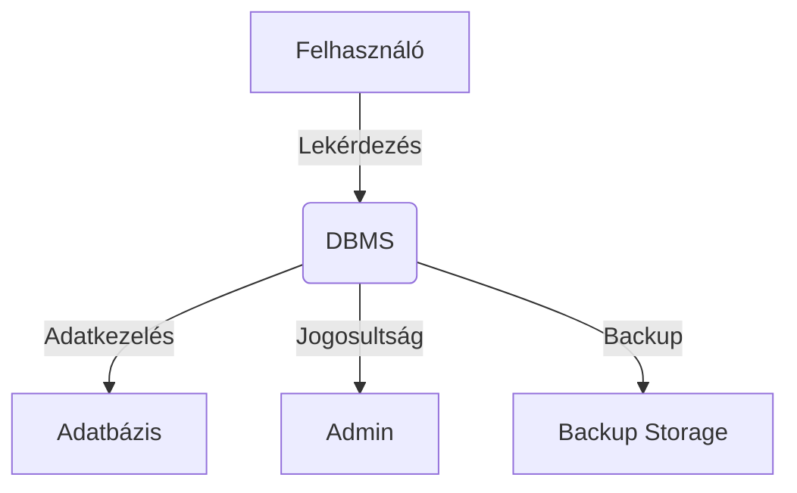

</details>

---

<details>
<summary><b>🧩 Egyed, tulajdonság, kapcsolat</b></summary>

| Fogalom | Leírás |
|---|---|
| **Egyed (Entity)** | Objektum vagy dolog, amelyről adatot tárolunk (pl. személy, autó, termék, esemény, szervezet, eszköz, tranzakció) |
| **Tulajdonság (Attribute)** | Az egyed jellemzője (pl. név, születési dátum, lakcím, ár, státusz, időbélyeg, leírás) |
| **Kapcsolat (Relationship)** | Egyedek közötti összefüggés (pl. Diák beiratkozik Tantárgyra, autóhoz tartozik tulajdonos, rendelés tartalmaz terméket) |

### Egyed-kapcsolat modellezés részletesen

Az egyedek az adatbázis modellezés alapjai. Minden egyedhez tartoznak tulajdonságok, amelyek leírják az egyed jellemzőit. Kapcsolatokkal írjuk le az egyedek közötti összefüggéseket. Kapcsolatok típusai: 1:1 (pl. minden embernek egy személyi igazolványa van), 1:N (pl. egy tanár több tantárgyat taníthat), N:M (pl. diákok több tantárgyra is beiratkozhatnak). Kulcsok szerepe: elsődleges kulcs (minden rekordot egyedileg azonosít, nem lehet NULL, nem ismétlődhet), idegen kulcs (kapcsolatok megvalósítása, referenciális integritás, hivatkozás másik tábla rekordjára), kompozit kulcs (összetett azonosítás, pl. beiratkozás (diák_id, tantárgy_id)). Tipikus hibák: duplikált rekordok, árva rekordok, NULL értékek kulcsban, hibás kapcsolatok. Best practice: mindig jelöld ki az egyedi azonosítót (PK), tartsd be a referenciális integritást (FK), használj kompozit kulcsot, ha szükséges, dokumentáld az egyedeket, tulajdonságokat, kapcsolatok típusát. Vizsgatipp: mindig rajzolj ER diagramot, és jelöld a kulcsokat, példákkal illusztráld a kapcsolatokat, kulcsokat.

**Ábra: Egyed-kapcsolat**
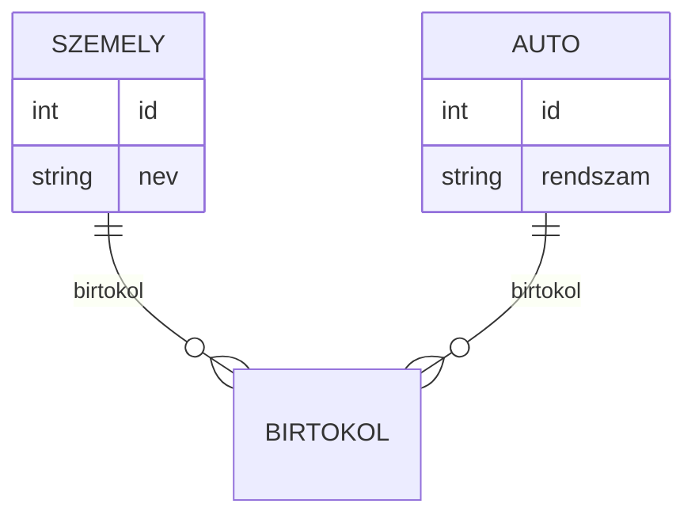

**Kapcsolatok típusai részletesen:**
- 1:1 – pl. minden embernek egy személyi igazolványa van
- 1:N – pl. egy tanár több tantárgyat taníthat
- N:M – pl. diákok több tantárgyra is beiratkozhatnak

**Ábra: Kapcsolattípusok**
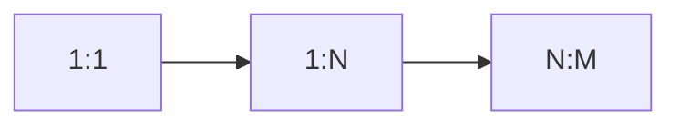

**Kulcsok szerepe:**
- Elsődleges kulcs: minden rekordot egyedileg azonosít
- Idegen kulcs: kapcsolatok megvalósítása
- Kompozit kulcs: összetett azonosítás

**Ábra: Kulcsok**
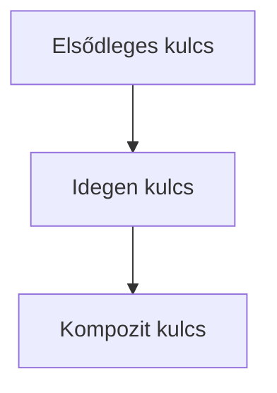
**Kapcsolatok típusai:**

- 1️⃣:1️⃣ Egy az egyhez (pl. minden embernek egy személyi igazolványa van)
- 1️⃣:N️⃣ Egy a többhöz (pl. egy tanár több tantárgyat taníthat)
- N️⃣:M️⃣ Több a többhöz (pl. diákok több tantárgyra is beiratkozhatnak)

**Kulcsok:**

- 🔑 Elsődleges kulcs (Primary Key): Egyedi azonosító, pl. id, email, azonosító szám
- 🗝️ Idegen kulcs (Foreign Key): Másik tábla kulcsára hivatkozik, referenciális integritás
- 🏷️ Alternatív kulcs: Egyedi, de nem elsődleges (pl. adószám)
- 🧩 Kompozit kulcs: Több mezőből álló egyedi azonosító

---
**Részletes magyarázat, elmélet, best practice, tipikus hibák, vizsgatippek, példák:**

**Egyedek modellezése:**
- Egyedek az adatbázis modellezés alapjai. Minden egyedhez tartoznak tulajdonságok, amelyek leírják az egyed jellemzőit.
- Egyedek lehetnek konkrét (pl. személy, autó) vagy absztrakt (pl. esemény, tranzakció).

**Tulajdonságok:**
- Lehetnek egyszerűek (név, ár), összetettek (cím: város, utca, irányítószám), származtatottak (életkor születési dátumból).
- Atomi, oszthatatlan értékek (1NF feltétel).

**Kapcsolatok:**
- Egyedek közötti összefüggések, pl. rendelés tartalmaz terméket, diák beiratkozik tantárgyra.
- Kapcsolatok lehetnek irányítottak, irányítatlanok, attribútumokkal bővítettek (pl. beiratkozás dátuma).

**Kapcsolatok részletezése:**
- 1:1 – pl. minden embernek egy személyi igazolványa van
- 1:N – pl. egy tanár több tantárgyat taníthat
- N:M – pl. diákok több tantárgyra is beiratkozhatnak

**Kulcsok szerepe:**
- Elsődleges kulcs: minden rekordot egyedileg azonosít, nem lehet NULL, nem ismétlődhet.
- Idegen kulcs: kapcsolatok megvalósítása, referenciális integritás, hivatkozás másik tábla rekordjára.
- Kompozit kulcs: összetett azonosítás, pl. beiratkozás (diák_id, tantárgy_id).

**Tipikus hibák:**
- Duplikált rekordok: nincs egyedi kulcs, ismétlődő adatok.
- Árva rekordok: idegen kulcs nem létezik, referenciális integritás sérül.
- NULL értékek kulcsban: nem megengedett.
- Hibás kapcsolatok: nem megfelelő hivatkozás, inkonzisztens adatok.

**Best practice:**
- Mindig jelöld ki az egyedi azonosítót (PK), tartsd be a referenciális integritást (FK).
- Használj kompozit kulcsot, ha szükséges (pl. összetett kapcsolatok).
- Dokumentáld az egyedeket, tulajdonságokat, kapcsolatok típusát.

**Vizsgatipp:**
- Mindig rajzolj ER diagramot, és jelöld a kulcsokat!
- Példákkal illusztráld a kapcsolatokat, kulcsokat.

**Gyakorlati példa:**
```sql
CREATE TABLE Diak (
	id INT PRIMARY KEY,
	nev VARCHAR(100)
);
CREATE TABLE Beiratkozas (
	diak_id INT REFERENCES Diak(id),
	tantargy_id INT,
	PRIMARY KEY (diak_id, tantargy_id)
);
```

**Mermaid ER diagram:**
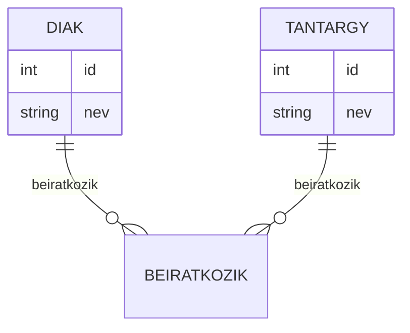

</details>

---

<details>
<summary><b>🗄️ Relációs, objektum-relációs és NoSQL adatbázisok</b></summary>

| Típus | Jellemzők | Előnyök | Hátrányok | Példa |
|---|---|---|---|---|
| **Relációs** | Táblák, szigorú séma, kulcsok, SQL, normalizálás, ACID | Adatintegritás, tranzakciók, összetett lekérdezések, referenciális integritás | Skálázhatóság korlátai, séma-merevség, komplex migráció | MySQL, PostgreSQL, Oracle, SQL Server |
| **Objektum-relációs** | Objektum-orientált elemek, komplex adatszerkezet, öröklődés, metódusok, típusok | Rugalmasabb modellezés, komplex adatok, OOP támogatás | Bonyolultabb séma, teljesítményproblémák, tanulási görbe | PostgreSQL (kiterjesztések), Oracle |
| **NoSQL** | Dokumentum, kulcs-érték, gráf, oszlopalapú, rugalmas séma, horizontális skálázás | Skálázhatóság, rugalmasság, nagy mennyiségű adat, gyors írás/olvasás | Adatintegritás, tranzakciók korlátozottak, inkonzisztens adatok | MongoDB, Redis, Neo4j, Cassandra |

**NoSQL típusok:**

- 📄 Dokumentum alapú (MongoDB, CouchDB)
- 🔑 Kulcs-érték alapú (Redis, Memcached)
- 🕸️ Gráf alapú (Neo4j, OrientDB)
- 🗃️ Oszlopalapú (Cassandra, HBase)

**Kódpéldák:**
```sql
SELECT * FROM Diak WHERE nev LIKE 'K%';
```
```js
// MongoDB
{ find: 'diak', filter: { nev: /^K/ } }
```

---
**Részletes magyarázat, elmélet, best practice, tipikus hibák, vizsgatippek, példák:**

**Relációs adatbázis:**
- Adatok táblákban, sorokban és oszlopokban, szigorú séma szerint. SQL nyelvet használ. Erős adatintegritás, összetett lekérdezések, normalizálás.
- Példa: banki rendszerek, vállalati ERP, CRM, pénzügyi nyilvántartás.

**Objektum-relációs adatbázis:**
- Relációs modell kiegészítve objektum-orientált elemekkel (öröklődés, metódusok, komplex típusok). Rugalmasabb, de bonyolultabb, OOP támogatás.
- Példa: komplex vállalati rendszerek, tudásbázisok.

**NoSQL adatbázis:**
- Nem relációs, rugalmas séma, horizontális skálázás, nagy mennyiségű adat. Típusai: dokumentum, kulcs-érték, gráf, oszlopalapú.
- Példa: webes alkalmazások, big data, IoT, social network.

**NoSQL típusok részletesen:**
- Dokumentum alapú: JSON/BSON dokumentumok, rugalmas séma, pl. MongoDB.
- Kulcs-érték alapú: gyors elérés, cache, pl. Redis.
- Gráf alapú: összefüggések, hálózatok, pl. Neo4j.
- Oszlopalapú: nagy mennyiségű adat, analitika, pl. Cassandra.

**Tipikus hibák:**
- Relációsban séma-merevség: nehéz változtatni, migrálni.
- NoSQL-ben adatintegritás hiánya, inkonzisztens adatok, tranzakciók hiánya.
- Objektum-relációsban komplexitás, teljesítményprobléma.

**Best practice:**
- Válaszd a relációs modellt, ha fontos az adatintegritás, összetett lekérdezés.
- NoSQL-t használj, ha nagy mennyiségű, gyorsan változó adat, skálázás a cél.
- Dokumentáld a sémát, teszteld a migrációkat.

**Vizsgatipp:**
- Mindig említsd, hogy mikor melyik típus előnyös!
- Hasonlítsd össze a modelleket, mutass példákat.

**Gyakorlati példa:**
```js
// MongoDB dokumentum
{
	nev: "Kiss Anna",
	szuletesi_datum: "2000-05-12"
}
```

**Mermaid összehasonlító diagram:**
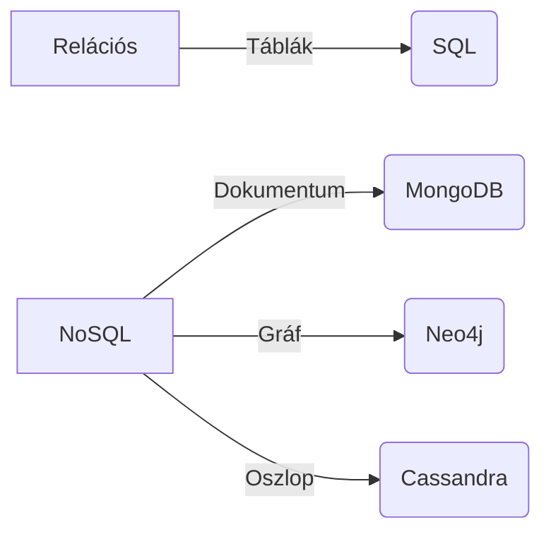

</details>

---

<details>
<summary><b>🔗 Funkcionális függés, normalizálás</b></summary>

**Funkcionális függés:**

> Egy attribútum (vagy attribútumok csoportja) értéke egyértelműen meghatározza egy másik attribútum értékét.

| Típus | Leírás |
|---|---|
| Teljes függés | Csak a teljes kulcstól függ |
| Részleges függés | Kulcs egy részétől függ |
| Tranzitív függés | Egy másik attribútumtól függ, ami maga is függ a kulcstól |

---
**Részletes magyarázat, elmélet, best practice, tipikus hibák, vizsgatippek, példák:**

**Funkcionális függés elmélet:**
- Egy attribútum (vagy attribútumok csoportja) értéke egyértelműen meghatározza egy másik attribútum értékét.
- Pl. diák azonosítója meghatározza a nevét, születési dátumát.
- Teljes függés: csak a teljes kulcstól függ (pl. beiratkozás: diák_id, tantárgy_id → dátum).
- Részleges függés: kulcs egy részétől függ (pl. csak diák_id-tól függ a név).
- Tranzitív függés: egy másik attribútumtól függ, ami maga is függ a kulcstól (pl. tantárgy_id → tantárgy név).

**Normalizálás:**
- Célja az adatok redundanciájának csökkentése, inkonzisztencia elkerülése.
- 1NF: Minden mező atomi, oszthatatlan érték.
- 2NF: Minden nem kulcs attribútum teljes kulcstól függ.
- 3NF: Nincsenek tranzitív függések.
- BCNF, 4NF, 5NF: további normalizálási szintek, speciális esetekre.

**Best practice:**
- Mindig normalizáld az adatbázist legalább 3NF-ig.
- Dokumentáld a függéseket, ellenőrizd a redundanciát.
- Használj diagramokat, példákat a magyarázathoz.

**Tipikus hibák:**
- Redundáns adatok, inkonzisztens rekordok.
- Nem megfelelő normalizálás, túlzott denormalizálás.
- Tranzitív, részleges függések figyelmen kívül hagyása.

**Vizsgatipp:**
- Mindig rajzolj függőségi diagramot, mutasd be a normalizálás lépéseit.
- Példákkal illusztráld a függéseket, normalizálást.

**Gyakorlati példa:**
```sql
-- 1NF: Atomi mezők
CREATE TABLE Diak (
	id INT PRIMARY KEY,
	nev VARCHAR(100),
	szuletesi_datum DATE
);
-- 2NF: Teljes kulcstól függés
CREATE TABLE Beiratkozas (
	diak_id INT,
	tantargy_id INT,
	datum DATE,
	PRIMARY KEY (diak_id, tantargy_id)
);
-- 3NF: Nincs tranzitív függés
CREATE TABLE Tantargy (
	id INT PRIMARY KEY,
	nev VARCHAR(100)
);
```

**Mermaid függőségi diagram:**
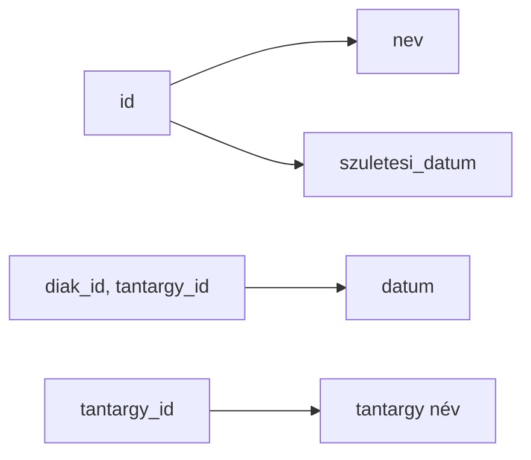

</details>

---

<details>
<summary><b>📐 Koncepcionális adatbázis-tervezés, ER modell</b></summary>

**Tervezési lépések:**

1. Egyedek és kapcsolatok azonosítása
2. Tulajdonságok meghatározása
3. Kulcsok kijelölése
4. ER diagram elkészítése
5. Relációs séma kialakítása
6. Normalizálás
7. Tesztelés, validáció
8. Dokumentáció, verziókövetés

### ER leképezés és oda-vissza példa

**ER leképezés lépései:**
	1. Egyedek és kapcsolatok azonosítása
	2. Tulajdonságok meghatározása
	3. Kulcsok kijelölése
	4. ER diagram elkészítése
	5. Relációs séma kialakítása
	6. Normalizálás
	7. Tesztelés, validáció
	8. Dokumentáció, verziókövetés

Az ER diagramból relációs sémát készítünk, majd vissza is tudjuk alakítani. Példa: ER diagram (egyedek, kapcsolatok, kulcsok), relációs séma leképezés (táblák, oszlopok, kulcsok), SQL példa (CREATE TABLE), visszaalakítás relációs sémából ER diagramra (minden tábla egy egyed, idegen kulcsokból kapcsolatok, kompozit kulcsból N:M kapcsolat). Best practice: mindig készíts ER diagramot, dokumentáld a sémát, teszteld a kapcsolatok, kulcsok működését, verziókövesd a séma változásait. Tipikus hibák: hiányzó kulcsok, hibás kapcsolatok, redundáns adatok, nem megfelelő normalizálás, inkonzisztens séma. Vizsgatipp: rajzolj ER diagramot, mutasd be a tervezési lépéseket, példákkal illusztráld a séma kialakítását.
**ER diagram példa:**
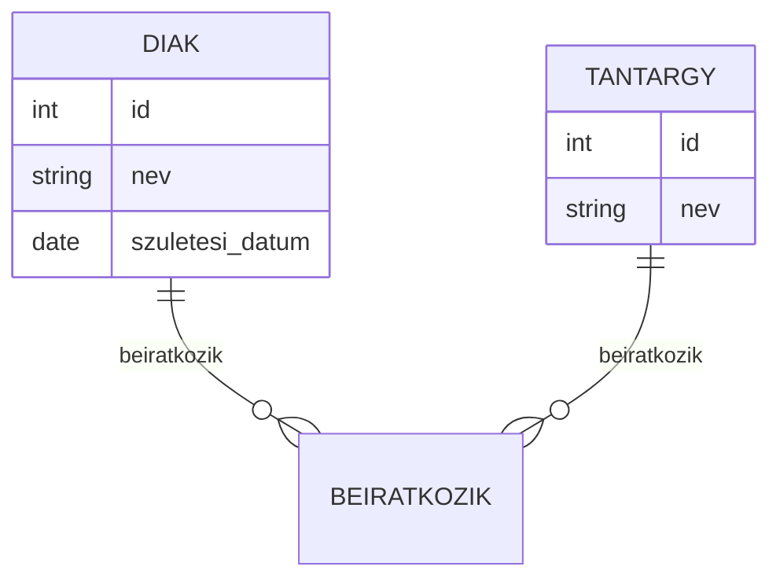

**Relációs leképezés:**
| Tábla | Oszlopok |
|---|---|
| Diák | id (PK), név, születési_dátum |
| Tantárgy | id (PK), név |
| Beiratkozás | diák_id (FK), tantárgy_id (FK), dátum |

---
**Részletes magyarázat, elmélet, best practice, tipikus hibák, vizsgatippek, példák:**

**Koncepcionális tervezés:**
- Célja az üzleti logika, folyamatok, adatok modellezése, függetlenül a technológiától.
- Egyedek, kapcsolatok, tulajdonságok, kulcsok, szabályok azonosítása.
- ER diagram: grafikus ábrázolás, egyedek, kapcsolatok, kulcsok, attribútumok.

**Relációs séma kialakítása:**
- Egyedekből táblák, kapcsolatokból idegen kulcsok, tulajdonságokból oszlopok.
- Normalizálás, redundancia csökkentése, integritás biztosítása.

**Tesztelés, validáció:**
- Tesztadatok, lekérdezések, integritási szabályok ellenőrzése.
- Verziókövetés, dokumentáció, változások nyomon követése.

**Best practice:**
- Mindig készíts ER diagramot, dokumentáld a sémát.
- Teszteld a kapcsolatok, kulcsok működését.
- Verziókövesd a séma változásait.

**Tipikus hibák:**
- Hiányzó kulcsok, hibás kapcsolatok, redundáns adatok.
- Nem megfelelő normalizálás, inkonzisztens séma.

**Vizsgatipp:**
- Rajzolj ER diagramot, mutasd be a tervezési lépéseket.
- Példákkal illusztráld a séma kialakítását.

**Gyakorlati példa:**
```sql
CREATE TABLE Diak (
	id INT PRIMARY KEY,
	nev VARCHAR(100),
	szuletesi_datum DATE
);
CREATE TABLE Tantargy (
	id INT PRIMARY KEY,
	nev VARCHAR(100)
);
CREATE TABLE Beiratkozas (
	diak_id INT REFERENCES Diak(id),
	tantargy_id INT REFERENCES Tantargy(id),
	datum DATE,
	PRIMARY KEY (diak_id, tantargy_id)
);
```

</details>

---

<details>
<summary><b>💻 SQL elemei: DDL, DML, DCL, lekérdezések</b></summary>

| Rövidítés | Jelentés | Példa |
|---|---|---|
| DDL | Data Definition Language | `CREATE`, `ALTER`, `DROP` |
| DML | Data Manipulation Language | `INSERT`, `UPDATE`, `DELETE`, `SELECT` |
| DCL | Data Control Language | `GRANT`, `REVOKE` |

**DDL példa:**
```sql
CREATE TABLE Diak (
	id INT PRIMARY KEY,
	nev VARCHAR(100),
	szuletesi_datum DATE
);
```

**DML példa:**
```sql
INSERT INTO Diak (id, nev, szuletesi_datum) VALUES (1, 'Kiss Anna', '2000-05-12');
UPDATE Diak SET nev = 'Kovács Anna' WHERE id = 1;
DELETE FROM Diak WHERE id = 1;
SELECT * FROM Diak;
```

**DCL példa:**
```sql
GRANT SELECT ON Diak TO user1;
REVOKE SELECT ON Diak FROM user1;
```

**Egyszerű lekérdezések:**
```sql
SELECT nev FROM Diak WHERE id = 1;
SELECT nev, szuletesi_datum FROM Diak WHERE nev LIKE 'K%';
```

**Táblák összekapcsolása (JOIN):**
| JOIN típus | Leírás |
|---|---|
| INNER JOIN | Mindkét táblában létező rekordok |
| LEFT JOIN | Minden rekord a bal oldali táblából |
| RIGHT JOIN | Minden rekord a jobb oldali táblából |
| FULL JOIN | Minden rekord mindkét táblából |

**INNER JOIN példa:**
```sql
SELECT Diak.nev, Tantargy.nev
FROM Beiratkozas
JOIN Diak ON Beiratkozas.diak_id = Diak.id
JOIN Tantargy ON Beiratkozas.tantargy_id = Tantargy.id;
```

**Összetett lekérdezések, aggregáció:**
```sql
-- Csoportosítás (GROUP BY)
SELECT Tantargy.nev, COUNT(*) AS diakok_szama
FROM Beiratkozas
JOIN Tantargy ON Beiratkozas.tantargy_id = Tantargy.id
GROUP BY Tantargy.nev;

-- Rendezés (ORDER BY)
SELECT nev FROM Diak ORDER BY szuletesi_datum DESC;

-- Allekérdezés (Subquery)
SELECT nev FROM Diak WHERE id IN (SELECT diak_id FROM Beiratkozas WHERE tantargy_id = 2);
```

---
**Részletes magyarázat, elmélet, best practice, tipikus hibák, vizsgatippek, példák:**

**SQL nyelv elemei:**
- DDL: séma létrehozása, módosítása, törlése (CREATE, ALTER, DROP).
- DML: adatok beszúrása, módosítása, törlése, lekérdezése (INSERT, UPDATE, DELETE, SELECT).
- DCL: jogosultságok kezelése, hozzáférés szabályozása (GRANT, REVOKE).

**Lekérdezések:**
- Egyszerű: SELECT, WHERE, ORDER BY, LIMIT.
- Összetett: JOIN, GROUP BY, HAVING, SUBQUERY, UNION.
- Aggregáció: COUNT, SUM, AVG, MIN, MAX.
- Allekérdezés: SELECT ... WHERE ... IN (...), EXISTS, NOT EXISTS.

**Best practice:**
- Használj indexeket a gyorsabb lekérdezéshez.
- Optimalizáld a lekérdezéseket, kerüld a felesleges JOIN-okat.
- Dokumentáld a sémát, jogosultságokat.

**Tipikus hibák:**
- Lassú lekérdezés: hiányzó index, nem optimalizált WHERE.
- Hibás JOIN: inkonzisztens adatok, duplikált rekordok.
- Jogosultsági hiba: túl széles jogok, nem megfelelő DCL.

**Vizsgatipp:**
- Írj példákat minden SQL elemre, mutasd be a lekérdezések eredményét.
- Rajzolj táblakapcsolati diagramot.

**Gyakorlati példa:**
```sql
-- Diákok neve és tantárgyak
SELECT Diak.nev, Tantargy.nev
FROM Beiratkozas
JOIN Diak ON Beiratkozas.diak_id = Diak.id
JOIN Tantargy ON Beiratkozas.tantargy_id = Tantargy.id;

-- Diákok száma tantárgyanként
SELECT Tantargy.nev, COUNT(*) AS diakok_szama
FROM Beiratkozas
JOIN Tantargy ON Beiratkozas.tantargy_id = Tantargy.id
GROUP BY Tantargy.nev;
```

**Mermaid SQL diagram:**
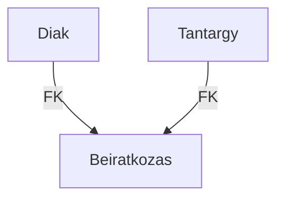

</details>

---

<div align="center">
	
</div>