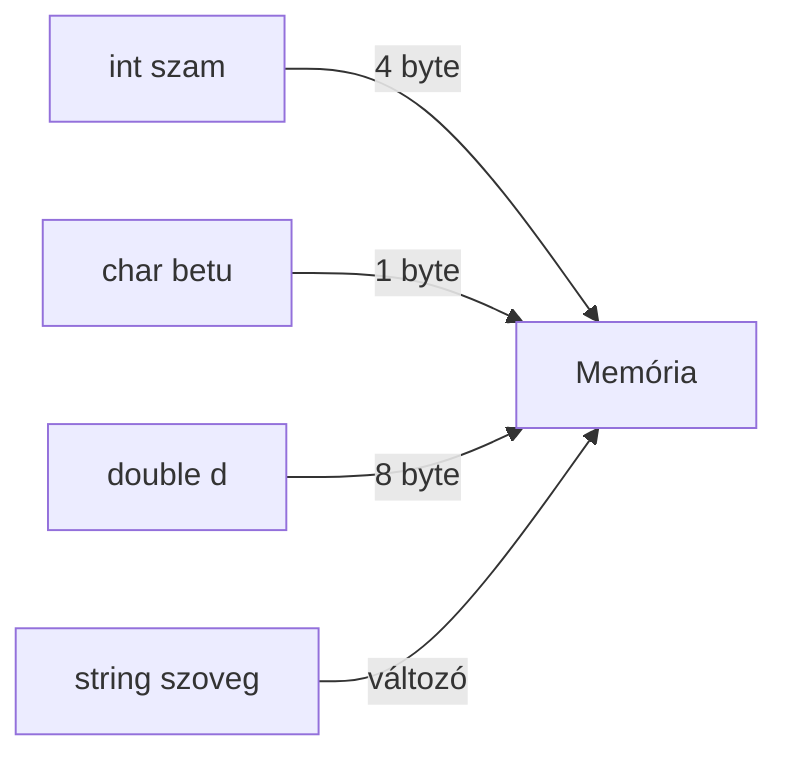

<div align="center">
  
</div>

---

<details>
<summary><b>🔢 Adattípusok, Változó</b></summary>

| Fogalom | Leírás | Példa |
|---|---|---|
| **Adattípus** | Meghatározza, milyen típusú értéket tárolhat egy változó, milyen műveletek végezhetők rajta, mennyi memóriát foglal | int, float, char, bool, string, double, long, short, unsigned |
| **Változó** | Olyan névvel ellátott memóriahely, amelyben értéket tárolunk, a program futása során változhat | `int szam = 5;` |

**Alapvető adattípusok:**
- Egész szám: `int`, `short`, `long`, `unsigned int`
- Valós szám: `float`, `double`, `long double`
- Logikai: `bool`
- Karakter: `char`, `unsigned char`
- Szöveg: `string`, `char[]`

**Összetett adattípusok:**
- Tömb (array): azonos típusú elemek sorozata
- Struktúra (struct): különböző típusú elemek csoportja
- Osztály (class): adatok és műveletek együtt
- Enum: felsorolt típus

**Felhasználó által definiált típusok:**
- struct, class, enum, typedef

---
**Miért fontos az adattípus?**
- Meghatározza, hogy a változó milyen értékeket vehet fel, milyen műveletek végezhetők rajta, mennyi memóriát foglal, hogyan viselkedik a programban.
- Segít elkerülni a hibákat, optimalizálja a memóriakezelést, növeli a program biztonságát.

**Típusosság előnyei:**
- Hibák korai felismerése (fordításkor)
- Memóriahatékonyság
- Kód olvashatósága, karbantarthatósága

**Típuskonverziók:**
- Implicit: automatikus (pl. int → float)
- Explicit: kényszerített (pl. (float)szam)
- Veszélyek: pontosság elvesztése, túlcsordulás, adatvesztés

**Memóriakezelés:**
- Minden típus más-más méretet foglal (int: 4 byte, char: 1 byte, double: 8 byte)
- Stack vs. heap: lokális vs. dinamikus változók

**Tipikus hibák:**
- Típuskonverzió (pl. int → float): elveszhet a pontosság
- Túlcsordulás: int túl nagy értéket kap
- Nem inicializált változó: véletlenszerű érték
- Rossz típusválasztás: felesleges memóriahasználat
- String vs. char[]: karakterlánc kezelési hibák

**Best practice:**
- Mindig inicializáld a változókat!
- Válaszd a legszűkebb, de elegendő típust!
- Dokumentáld, hogy miért azt a típust választottad!
- Használj konstansokat, ha az érték nem változik!

**Vizsgatipp:**
- Mindig írd le, hogy egy változó milyen típusú, és miért azt választottad!
- Rajzolj memóriakezelési diagramot, mutasd be a típusok méretét!

**Memóriakezelés ábra:**


**Gyakorlati példa:**
```cpp
int szam = 2147483647; // int maximum
szam = szam + 1; // túlcsordulás, szam értéke: -2147483648

float f = 3.14f;
double d = 2.718281828;
char c = 'A';
bool igaz = true;
string nev = "Anna";

// Tömb
int tomb[5] = {1,2,3,4,5};

// Struktúra
struct Pont { int x; int y; } p1;

// Enum
enum Nap { Hetfo, Kedd, Szerda };
Nap n = Hetfo;
```

</details>

---

<details>
<summary><b>➕ Műveletek, operátorok, operandusok</b></summary>

| Fogalom | Leírás | Példa |
|---|---|---|
| **Művelet** | Adatokon végzett eljárás | összeadás, kivonás |
| **Operátor** | A műveletet jelölő szimbólum | `+`, `-`, `*`, `/`, `%`, `==`, `!=` |
| **Operandus** | Az operátor által összekapcsolt értékek | `a + b` esetén: a, b |

**Operátorok csoportjai:**
- Aritmetikai: `+`, `-`, `*`, `/`, `%`
- Relációs: `==`, `!=`, `<`, `>`, `<=`, `>=`
- Logikai: `&&`, `||`, `!`
- Hozzárendelés: `=`, `+=`, `-=`

---
**Részletes magyarázat:**

Az operátorok a programozás alapvető építőkövei. Az operandusok az értékek, amelyeken a művelet végrehajtódik. Az operátorok precedenciája (műveleti sorrend) fontos, pl. szorzás előbb, mint összeadás.

**Precedencia példa:**
`a + b * c` → először `b * c`, majd hozzáadjuk `a`-t.

**Tipikus hibák:**
- Osztás egész típusokkal: `5 / 2 = 2` (nem 2.5!)
- Logikai operátorok: `&&` és `||` rövidzáras kiértékelés

**Vizsgatipp:**
Írd le, hogy egy kifejezésben mi az operátorok sorrendje, és hogyan befolyásolja az eredményt!

**Gyakorlati példa:**
```cpp
int a = 5, b = 2;
float c = a / b; // c = 2.0, nem 2.5!
c = (float)a / b; // c = 2.5
```

</details>

---

<details>
<summary><b>🔀 Vezérlési szerkezetek</b></summary>

| Szerkezet | Leírás | Példa |
|---|---|---|
| **Elágazás** | Feltétel alapján különböző utasítások | `if`, `else`, `switch` |
| **Ciklus** | Ismétlődő utasítások | `for`, `while`, `do-while` |
| **Ugrás** | Vezérlés átadása más helyre | `break`, `continue`, `return` |

```c
if (a > b) {
	printf("a nagyobb");
} else {
	printf("b nagyobb vagy egyenlő");
}

for (int i = 0; i < 5; i++) {
	printf("%d ", i);
}
```

---
**Részletes magyarázat:**

Vezérlési szerkezetek határozzák meg a program futásának menetét. Elágazásokkal döntéseket hozunk, ciklusokkal ismétlünk, ugrásokkal megszakítjuk vagy folytatjuk a futást.

**Ciklusok fajtái:**
- Előtesztelő: `while` (feltétel a ciklus előtt)
- Utótesztelő: `do-while` (feltétel a ciklus után)
- Számláló: `for` (ismétlésszám ismert)

**Tipikus hibák:**
- Végtelen ciklus: feltétel sosem lesz hamis
- Elágazásban elfelejtett `else`: váratlan viselkedés

**Vizsgatipp:**
Írd le, hogy a vezérlési szerkezet hogyan befolyásolja a program futását, és adj példát végtelen ciklusra!

**Gyakorlati példa:**
```cpp
int i = 0;
while (i < 5) {
    printf("%d ", i);
    i++;
}
```

</details>

---

<details>
<summary><b>🧮 Kifejezések, Utasítások</b></summary>

| Fogalom | Leírás | Példa |
|---|---|---|
| **Kifejezés** | Olyan rész, amelynek van értéke | `a + b * 2` |
| **Utasítás** | Végrehajtandó művelet, parancs | `x = 5;` |

**Kifejezés példák:**
- `x + y`
- `x > 10 && y < 5`

**Utasítás példák:**
- Változó értékadás: `a = 10;`
- Függvényhívás: `print(a);`

---
**Részletes magyarázat:**

Kifejezés: minden olyan programrész, amelynek van értéke. Utasítás: végrehajtandó parancs, amely lehet kifejezés is (pl. értékadás).

**Kifejezések fajtái:**
- Literál: konkrét érték (`5`, `'a'`)
- Összetett: több operátor, több operandus
- Függvényhívás: visszatérési értékkel

**Tipikus hibák:**
- Kifejezés helyett utasítás használata, vagy fordítva
- Zárójelezés hiánya: más eredmény

**Vizsgatipp:**
Írd le, hogy egy utasítás mikor tartalmaz kifejezést, és adj példát!

**Gyakorlati példa:**
```cpp
int a = 5;
int b = 10;
int c = a + b * 2; // kifejezés
printf("%d", c); // utasítás
```

</details>

---

<details>
<summary><b>📦 Programegységek, Paraméterek</b></summary>

| Fogalom | Leírás | Példa |
|---|---|---|
| **Programegység** | Önállóan kezelhető kódrészlet (pl. függvény, eljárás, modul) | `int osszeg(int a, int b)` |
| **Paraméterkiértékelés** | Függvényhíváskor a paraméterek értékének meghatározása | `osszeg(2, 3)` |
| **Paraméterátadás** | Érték vagy hivatkozás szerint | `void f(int x)` (érték), `void f(int &x)` (hivatkozás) |

**Példa C++-ban:**
```cpp
int osszeg(int a, int b) {
	return a + b;
}
```

---
**Részletes magyarázat:**

Programegység: önállóan kezelhető, újrahasznosítható kódrészlet (függvény, eljárás, osztály, modul). Segíti a strukturált programozást, csökkenti a hibák számát.

**Paraméterátadás módjai:**
- Érték szerint: másolatot kap a függvény
- Referencia szerint: eredeti változót módosítja
- Pointer szerint: cím alapján

**Tipikus hibák:**
- Érték szerinti átadásnál a változás nem látszik kívül
- Referencia/pointer átadásnál véletlen módosítás

**Vizsgatipp:**
Írd le, hogy a paraméterátadás módja hogyan befolyásolja a függvény működését!

**Gyakorlati példa:**
```cpp
void novel(int &x) {
    x++;
}
int a = 5;
novel(a); // a = 6
```

</details>

---

<details>
<summary><b>🧱 Blokk, Hatáskör, Láthatóság</b></summary>

| Fogalom | Leírás | Példa |
|---|---|---|
| **Blokk** | Kapcsolódó utasítások csoportja `{ ... }` | `if (...) { ... }` |
| **Hatáskör (scope)** | Ahol egy változó elérhető | lokális, globális |
| **Láthatóság** | Változó, függvény elérhetősége | public, private |

**Példa:**
```cpp
int x = 5; // globális
void f() {
	int y = 10; // lokális
}
```

---
**Részletes magyarázat:**

Blokk: egymáshoz tartozó utasítások csoportja, amelyben a változók hatásköre (scope) korlátozott. A hatáskör határozza meg, hogy egy változó hol érhető el. Láthatóság: objektum-orientált programozásban a tagok elérhetősége (public, private, protected).

**Hatáskör fajtái:**
- Globális: program minden részén elérhető
- Lokális: csak adott blokkban
- Statikus: csak adott fájlban

**Tipikus hibák:**
- Árnyékolás: lokális változó elrejti a globálist
- Véletlenül globális változó használata

**Vizsgatipp:**
Írd le, hogy egy változó hol él, és mi történik, ha azonos nevű változók vannak különböző blokkokban!

**Gyakorlati példa:**
```cpp
int x = 10;
void f() {
	int x = 20; // árnyékolja a globális x-et
	printf("%d", x); // 20
}
printf("%d", x); // 10
```

</details>

---

<details>
<summary><b>🧩 Absztrakt adattípus (ADT)</b></summary>

| Fogalom | Leírás | Példa |
|---|---|---|
| **Absztrakt adattípus** | Olyan adattípus, amelynek csak a műveleteit és viselkedését definiáljuk, a megvalósítást elrejtjük | lista, verem, sor |

**Példa:**
```cpp
class Verem {
	public:
		void push(int x);
		int pop();
};
```

---
**Részletes magyarázat:**

Az absztrakt adattípus (ADT) egy olyan modell, amely csak a műveleteket és azok viselkedését írja le, a belső megvalósítást elrejti. Ez lehetővé teszi, hogy a programozó csak a használatra koncentráljon, ne a részletekre.

**Példák ADT-re:**
- Verem (stack): LIFO (Last In First Out)
- Sor (queue): FIFO (First In First Out)
- Lista: elemek sorozata

**Tipikus hibák:**
- Nem megfelelő művelet használata (pl. üres veremből pop)
- Megvalósítási részletek kiszivárognak

**Vizsgatipp:**
Írd le, hogy az ADT miért fontos az absztrakcióban, és adj példát saját ADT-re!

**Gyakorlati példa:**
```cpp
class Sor {
    public:
        void betesz(int x);
        int kivesz();
};
```

</details>

---

<details>
<summary><b>⚠️ Kivételkezelés</b></summary>

| Fogalom | Leírás | Példa |
|---|---|---|
| **Kivétel** | Rendkívüli esemény, amely megszakítja a normál programfutást | osztás nullával |
| **Kivételkezelés** | Hibák kezelése, program stabilitásának növelése | try-catch szerkezet |

**Példa C++-ban:**
```cpp
try {
	int x = 5 / 0;
} catch (const std::exception& e) {
	std::cout << "Hiba: " << e.what();
}
```

---
**Részletes magyarázat:**

Kivétel: olyan esemény, amely megszakítja a normál programfutást (pl. osztás nullával, fájl nem található). Kivételkezelés: a hibák kezelése, hogy a program ne álljon le váratlanul.

**Kivételkezelés lépései:**
1. Kivétel dobása (`throw`)
2. Kivétel elkapása (`catch`)
3. Hibakezelés, helyreállítás

**Tipikus hibák:**
- Nem kezelt kivétel: program leáll
- Túl általános catch: nem tudjuk, mi a hiba

**Vizsgatipp:**
Írd le, hogy a kivételkezelés hogyan növeli a program stabilitását, és adj példát saját kivételre!

**Gyakorlati példa:**
```cpp
try {
    throw std::runtime_error("Saját hiba");
} catch (const std::exception& e) {
    std::cout << "Kivétel: " << e.what();
}
```

</details>

---

<div align="center">
	
</div>