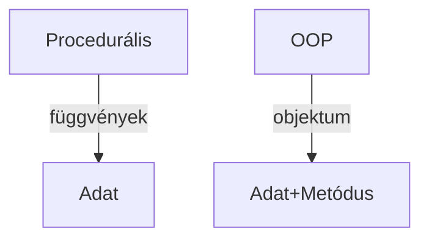
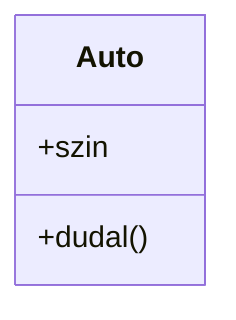
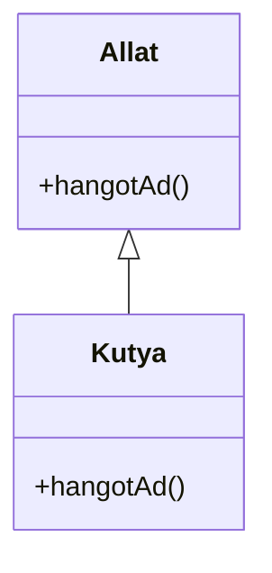
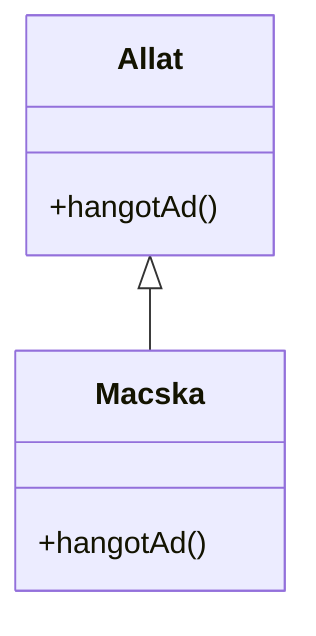
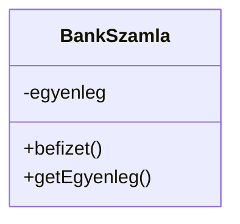
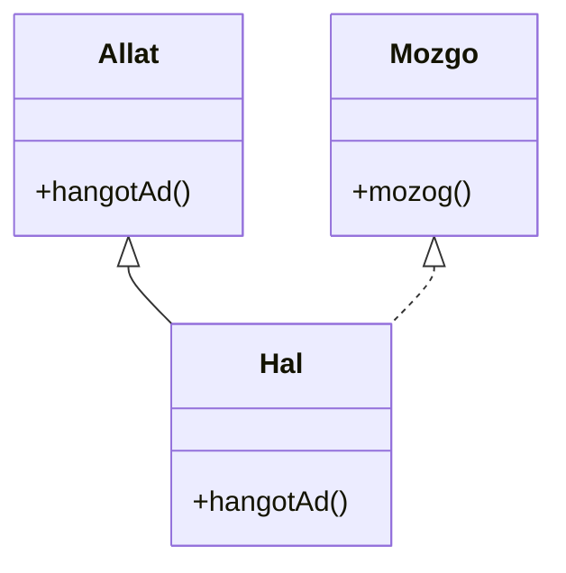
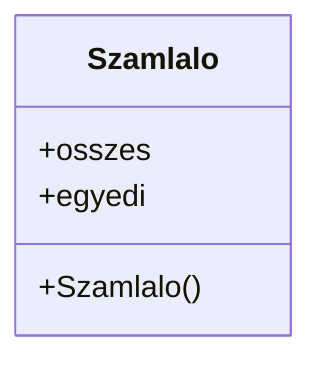

<div align="center">
  
</div>

---

<details>
<summary><b>🧭 Az objektumorientált paradigma alapfogalmai</b></summary>

## Objektumorientált programozás (OOP) – összefésült, részletes kidolgozás

### 1. Paradigmák és alapfogalmak
* **Programozási paradigmák:**
  - Procedurális: műveletek (függvények, eljárások) sorozata, adatok és műveletek elkülönülnek
  - Objektumorientált: adatok és műveletek (metódusok) egy egységbe, objektumba zárva
* **OOP fő fogalmai:**
  - Osztály: sablon, amely meghatározza az objektumok adatait (mezőit) és viselkedését (metódusait)
  - Objektum: az osztály konkrét példánya, saját állapottal
  - Példányosítás: objektum létrehozása az osztály alapján
  - Metódus: az objektum viselkedése, műveletei
  - Állapot: az objektum aktuális adatai, mezői

**Ábra:**


### 2. OOP célja, absztrakció
* Csak a lényeges tulajdonságokat, viselkedést emeljük ki, a részleteket elrejtjük (absztrakció)
* Komplexitás csökkentése, nagy rendszerek fejlesztésének támogatása
* Egy osztály csak egy felelősséget lásson el (Single Responsibility Principle)
* Mindig metóduson keresztül érjük el az adatokat (encapsulation)

**Példa (Java):**
```java
class Auto {
    String szin;
    void dudal() { System.out.println("Tuut! Tuut!"); }
}
Auto a = new Auto(); // példányosítás
a.szin = "piros";
a.dudal();
```

**UML ábra:**


### 3. Öröklődés, osztályhierarchia
* Egy osztály egy másik osztályból származtatható (inheritance)
* Szülő (superclass, base class): örökített osztály
* Gyerek (subclass, derived class): öröklő osztály
* Kód újrahasznosítás, hierarchikus szervezés
* Leszármazott osztály bővítheti vagy felülírhatja a szülő viselkedését

**Példa (Java):**
```java
class Allat {
    void hangotAd() { System.out.println("Hangot ad!"); }
}
class Kutya extends Allat {
    void hangotAd() { System.out.println("Vau!"); }
}
Allat a = new Kutya();
a.hangotAd(); // Vau!
```

**Ábra:**


### 4. Polimorfizmus, metódustúlterhelés
* Polimorfizmus: objektumok különböző típusai egységesen kezelhetők, metódusok viselkedése futásidőben dől el (dinamikus kötés)
* Metódustúlterhelés (overloading): ugyanaz a metódusnév többféle paraméterlistával
* Fordításidejű polimorfizmus: metódustúlterhelés, generikusok

**Példa (Java):**
```java
class Szamolo {
    int osszeg(int a, int b) { return a + b; }
    double osszeg(double a, double b) { return a + b; }
}
Szamolo s = new Szamolo();
s.osszeg(2, 3); // 5
s.osszeg(2.5, 3.5); // 6.0
```

**Polimorfizmus ábra:**


### 5. Egyégbe zárás (Encapsulation)
* Adatok és működés elrejtése az objektumon belül
* Csak a szükséges metódusok publikusak, belső állapot védett
* Láthatóság: private (csak osztályon belül), public (bárhonnan), protected (osztályból és leszármazottakból)
* Getter/setter metódusokkal szabályozzuk az adatok elérését

**Példa (Java):**
```java
class BankSzamla {
    private int egyenleg;
    public void befizet(int osszeg) { egyenleg += osszeg; }
    public int getEgyenleg() { return egyenleg; }
}
```

**Encapsulation ábra:**


### 6. Absztrakt osztály, interfész
* Absztrakt osztály: nem példányosítható, csak leszármaztatásra szolgál, lehet absztrakt és konkrét metódus
* Interfész: csak metódusok deklarációja, implementáció nincs, egy osztály több interfészt is megvalósíthat
* Közös viselkedés és szerkezet meghatározása
* Interfészek szerződés szerepet töltenek be

**Példa (Java):**
```java
abstract class Allat {
    abstract void hangotAd();
}
interface Mozgo {
    void mozog();
}
class Hal extends Allat implements Mozgo {
    void hangotAd() { System.out.println("Blubb!"); }
    public void mozog() { System.out.println("Úszik"); }
}
```

**Ábra:**


### 7. Típustagok (Tagok, tagváltozók, tagfüggvények)
* Tagváltozó (field): osztályhoz tartozó adat
* Tagfüggvény (method): osztályhoz tartozó művelet
* Statikus tag: osztályhoz tartozik, nem az objektumhoz, minden példány közösen használja
* Példánytag: minden objektumnak saját értéke van
* Láthatóság (public, private, protected) szabályozza az elérhetőséget

**Példa (Java):**
```java
class Szamlalo {
    static int osszes = 0;
    int egyedi;
    Szamlalo() {
        osszes++;
        egyedi = osszes;
    }
}
Szamlalo a = new Szamlalo();
Szamlalo b = new Szamlalo();
System.out.println(a.egyedi); // 1
System.out.println(b.egyedi); // 2
System.out.println(Szamlalo.osszes); // 2
```

**Ábra:**


### 8. Összefoglaló ábra: OOP fő elemei
```mermaid
classDiagram
    class Osztaly {
        +adat
        +metodus()
    }
    Osztaly <|-- Objektum
    Osztaly <|-- LeszarmazottOsztaly
    interface Interfesz {
        +metodus()
    }
    LeszarmazottOsztaly <|.. Interfesz
```

</details>

---

<details>
<summary><b>🌳 Öröklődés, osztályhierarchia</b></summary>

Az öröklődés (inheritance) lehetővé teszi, hogy egy osztály egy másik osztályból származtatható legyen, így átveszi annak tulajdonságait és metódusait. Az osztályhierarchia a leszármazási viszonyokat mutatja.

**Fő fogalmak:**
- **Szülő (superclass, base class):** Az örökített osztály.
- **Gyerek (subclass, derived class):** Az öröklő osztály.

**Vizsgatipp:**
Rajzolj osztályhierarchiát, és mutasd be, hogyan öröklődnek a tagok!

**Gyakorlati példa (Java):**
```java
class Allat {
    void hangotAd() { System.out.println("Hangot ad!"); }
}
class Kutya extends Allat {
    void hangotAd() { System.out.println("Vau!"); }
}
Allat a = new Kutya();
a.hangotAd(); // Vau!
```

**Ábra (Mermaid):**


---
**Részletes magyarázat:**

Az öröklődés lehetővé teszi a kód újrahasznosítását, a hierarchikus szervezést. A leszármazott osztály bővítheti vagy felülírhatja a szülő osztály viselkedését. Többszörös öröklődés (pl. C++) bonyolultabb, Java-ban csak interfészekkel lehetséges.

**Tipikus hibák:**
- Nem megfelelő öröklési irány: "is-a" vs. "has-a" kapcsolat összekeverése
- Konstruktorok helytelen hívása
- Tagok árnyékolása

**Vizsgatipp:**
Írd le, hogy az öröklődés hogyan segíti a kód újrahasznosítását, és mutass be felülírást (override)!

**Advanced példa:**
```java
class Allat {
    void hangotAd() { System.out.println("Hangot ad!"); }
}
class Macska extends Allat {
    @Override
    void hangotAd() { System.out.println("Miau!"); }
}
```

</details>

---

<details>
<summary><b>🔀 Polimorfizmus, metódustúlterhelés</b></summary>

**Polimorfizmus:**
Az objektumok különböző típusai egységesen kezelhetők, a metódusok viselkedése futásidőben dől el.

**Metódustúlterhelés (overloading):**
Ugyanaz a metódusnév többféle paraméterlistával használható.

**Vizsgatipp:**
Írd le, hogy a polimorfizmus miért teszi rugalmasabbá a programot!

**Gyakorlati példa (Java):**
```java
class Szamolo {
    int osszeg(int a, int b) { return a + b; }
    double osszeg(double a, double b) { return a + b; }
}
Szamolo s = new Szamolo();
s.osszeg(2, 3); // 5
s.osszeg(2.5, 3.5); // 6.0
```

---
**Részletes magyarázat:**

Polimorfizmus: ugyanazt a műveletet különböző típusú objektumok eltérően valósítják meg. Futásidejű polimorfizmus: dinamikus kötés, metódus felülírás. Fordításidejű polimorfizmus: metódustúlterhelés, generikusok.

**Tipikus hibák:**
- Nem megfelelő metódus felülírás (pl. szignatúra eltérés)
- Túlterhelésnél nem egyértelmű hívás

**Vizsgatipp:**
Írd le, hogy a polimorfizmus hogyan segíti a bővíthetőséget, és mutass be dinamikus kötést!

**Advanced példa:**
```java
Allat a = new Macska();
a.hangotAd(); // Miau! (dinamikus kötés)
```

</details>

---

<details>
<summary><b>🔒 Bezárási eszközrendszer (Encapsulation)</b></summary>

Az adatok és a működés elrejtése az objektumon belül. Csak a szükséges metódusok publikusak, a belső állapot védett.

**Fő fogalmak:**
- **private:** csak az osztályon belül érhető el
- **public:** bárhonnan elérhető
- **protected:** csak az osztályból és leszármazottakból

**Vizsgatipp:**
Mindig mutasd be, hogyan véded az adatokat az osztályban!

**Gyakorlati példa (Java):**
```java
class BankSzamla {
    private int egyenleg;
    public void befizet(int osszeg) { egyenleg += osszeg; }
    public int getEgyenleg() { return egyenleg; }
}
```

---
**Részletes magyarázat:**

Az encapsulation lényege, hogy az objektum belső állapota csak ellenőrzött módon érhető el. Getter/setter metódusokkal szabályozzuk az adatok elérését. Ez segít a hibák elkerülésében, a biztonságban, és a karbantarthatóságban.

**Tipikus hibák:**
- Közvetlen mezőelérés (public field)
- Setter nélkül: nem módosítható adat
- Getter nélkül: nem olvasható adat

**Vizsgatipp:**
Írd le, hogy az encapsulation hogyan segíti a hibák elkerülését, és mutass be getter/setter mintát!

**Advanced példa:**
```java
class Ember {
    private int kor;
    public int getKor() { return kor; }
    public void setKor(int kor) {
        if (kor >= 0) this.kor = kor;
    }
}
```

</details>

---

<details>
<summary><b>🧩 Absztrakt osztályok és interfészek</b></summary>

**Absztrakt osztály:**
Nem példányosítható, csak leszármaztatásra szolgál. Tartalmazhat absztrakt (implementáció nélküli) és konkrét metódusokat.

**Interfész:**
Csak metódusok deklarációját tartalmazza, implementációt nem. Egy osztály több interfészt is megvalósíthat.

**Vizsgatipp:**
Írd le, mikor használunk absztrakt osztályt és mikor interfészt!

**Gyakorlati példa (Java):**
```java
abstract class Allat {
    abstract void hangotAd();
}
class Macska extends Allat {
    void hangotAd() { System.out.println("Miau!"); }
}
interface Mozgo {
    void mozog();
}
class Hal extends Allat implements Mozgo {
    void hangotAd() { System.out.println("Blubb!"); }
    public void mozog() { System.out.println("Úszik"); }
}
```

---
**Részletes magyarázat:**

Az absztrakt osztályok lehetővé teszik a közös viselkedés és szerkezet meghatározását, de nem példányosíthatók. Az interfészek a szerződés szerepét töltik be: megmondják, hogy mit kell tudnia egy osztálynak, de nem mondják meg, hogyan.

**Tipikus hibák:**
- Absztrakt metódus implementációjának elfelejtése
- Több interfész implementálásakor névütközés

**Vizsgatipp:**
Írd le, hogy az absztrakt osztály és interfész mikor előnyös, és mutass be több interfész implementálását!

**Advanced példa:**
```java
interface Repulo {
    void repul();
}
interface Mozgo {
    void mozog();
}
class Madar extends Allat implements Repulo, Mozgo {
    void hangotAd() { System.out.println("Csipog!"); }
    public void repul() { System.out.println("Repül"); }
    public void mozog() { System.out.println("Sétál"); }
}
```

</details>

---

<details>
<summary><b>🔖 Típustagok (Tagok, tagváltozók, tagfüggvények)</b></summary>

Az osztályon belül található változók (mezők) és függvények (metódusok) az osztály tagjai.

**Fő fogalmak:**
- **Tagváltozó (field):** az osztályhoz tartozó adat
- **Tagfüggvény (method):** az osztályhoz tartozó művelet

**Statikus tag:**
Az osztályhoz tartozik, nem az objektumhoz. Minden példány közösen használja.

**Vizsgatipp:**
Mutasd be, hogyan különböztetjük meg a statikus és példány tagokat!

**Gyakorlati példa (Java):**
```java
class Szamlalo {
    static int osszes = 0;
    int egyedi;
    Szamlalo() {
        osszes++;
        egyedi = osszes;
    }
}
Szamlalo a = new Szamlalo();
Szamlalo b = new Szamlalo();
System.out.println(a.egyedi); // 1
System.out.println(b.egyedi); // 2
System.out.println(Szamlalo.osszes); // 2
```

---
**Részletes magyarázat:**

Az osztály tagjai lehetnek példánytagok (minden objektumnak saját értéke van) vagy statikus tagok (az osztályhoz tartoznak, minden példány közösen használja). A tagfüggvények az osztály viselkedését írják le. A láthatóság (public, private, protected) szabályozza az elérhetőséget.

**Tipikus hibák:**
- Statikus tagot példányon keresztül hívni
- Tagváltozó inicializálásának elfelejtése

**Vizsgatipp:**
Írd le, hogy mikor használunk statikus tagot, és mutass be példánytagot!

**Advanced példa:**
```java
class Konstansok {
    public static final double PI = 3.14159;
}
System.out.println(Konstansok.PI);
```

</details>

---

<div align="center">
  
</div>