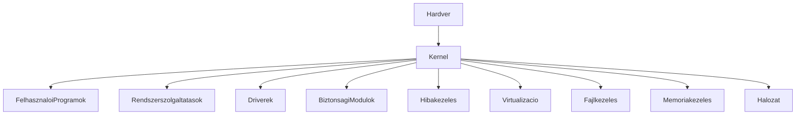
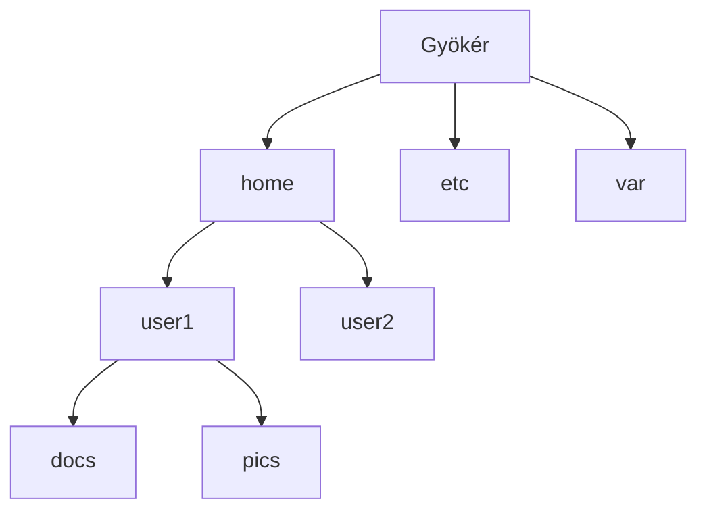
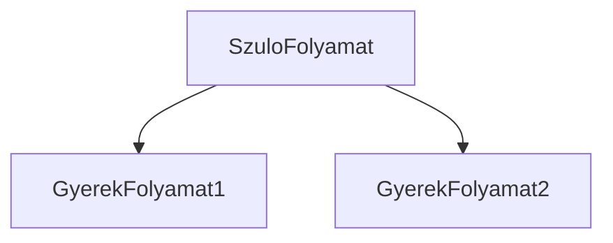
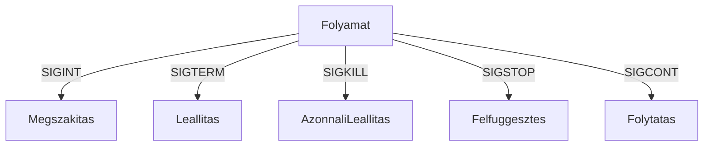
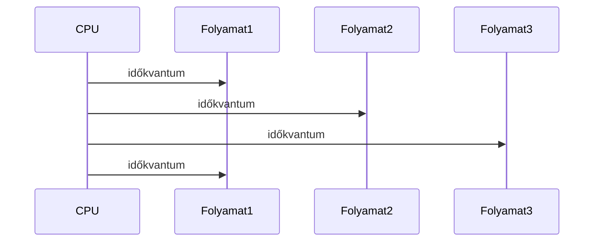

<div align="center">
	
</div>

---

<details>
<summary><b>🖥️ Operációs rendszer fogalma, architektúra, osztályozás</b></summary>

| Fogalom | Leírás |
|---|---|
| **Operációs rendszer (OS)** | A számítógép legfontosabb szoftvere, amely a hardver és a felhasználói programok között közvetít. |
| **Kernel** | Az OS magja, közvetlenül kezeli a hardvert, folyamatokat, memóriát, eszközöket, rendszerhívásokat. |
| **Felhasználói felület** | CLI (parancssor), GUI (grafikus), webes, érintőképernyős, hangvezérelt. |
| **Rendszerszolgáltatás** | Folyamatkezelés, memóriakezelés, fájlkezelés, hálózat, eszközkezelés, jogosultságkezelés, hibakezelés. |
| **OS osztályozás** | Felhasználók száma, feladatok száma, időosztás, architektúra, modern trendek. |

**Elmélet, részletes magyarázat:**
Az OS fő feladatai: erőforrások kezelése (CPU, memória, háttértár, perifériák), programok futtatása, biztonság, stabilitás, felhasználói élmény biztosítása, hardver absztrakció. Történeti áttekintés: kötegelt rendszerek, multiprogramozás, interaktív rendszerek, GUI, multitasking, virtualizáció, konténerizáció, felhő, mobil, IoT.

**Ábra: OS architektúra**


**Kernel típusok:**
| Típus | Jellemzők | Példák |
|---|---|---|
| Monolitikus | Minden funkció egyetlen nagy kernelben | Linux, Unix |
| Mikrokernel | Csak alap funkciók a kernelben, többi modul külön | Minix, QNX, L4 |
| Hibrid | Monolitikus és mikrokernel elemek keverve | Windows NT, macOS, XNU |
| Moduláris | Dinamikusan betölthető modulok, driver-ek | modern Linux, Solaris |
| Virtualizációs | Hypervisor, VM-ek, konténerizáció | Docker, LXC |

**Best practice:**
- Mindig említsd a kernel szerepét, és hogy az OS hogyan kezeli az erőforrásokat!
- Rajzolj architektúra diagramot, mutasd be a fő modulokat!
- Ismerd a fő OS-eket, tudj legalább 3-at felsorolni!

**Tipikus hibák:**
- Kernel panic, deadlock, race condition, memóriaszivárgás
- Hibás driver, hibás konfiguráció, jogosultsági hiba

**Vizsgatipp:**
- Hasonlítsd össze a kernel típusokat, mondj példákat!
- Példákkal illusztráld a tipikus hibákat és azok elkerülését!

**Gyakorlati példa:**
- Linux, Windows, macOS, Unix, Android, iOS, FreeBSD, Solaris, z/OS, Chrome OS, QNX, Minix, OpenBSD

</details>

---

<details>
<summary><b>📁 Fájlok és fájlrendszerek</b></summary>

| Fogalom | Leírás |
|---|---|
| **Fájl** | Adatok elnevezett, tartós tárolási egysége. |
| **Fájlrendszer** | A fájlok szervezésének, tárolásának és elérésének módja. |
| **Jogosultság** | Olvasás, írás, futtatás jogok, felhasználók, csoportok, root/admin jogok, ACL. |

**Elmélet, részletes magyarázat:**
A fájlok attribútumai: név, típus, méret, jogosultság, létrehozási/módosítási dátum. Fájlrendszerek: hierarchikus (Unix, Windows), sík (régi rendszerek). Főbb fájlrendszerek: FAT, NTFS, ext2/3/4, HFS+, APFS, ZFS, XFS, Btrfs. Fájlműveletek: létrehozás, olvasás, írás, törlés, átnevezés, jogosultságok módosítása, listázás, keresés, tömörítés.

**Ábra: Fájlrendszer hierarchia**


**Best practice:**
- Mindig legyen rendszeres backup, tesztelt visszaállítás.
- Használj megfelelő jogosultságokat, auditáld a hozzáféréseket.
- Optimalizáld a fájlműveleteket, indexeket.

**Tipikus hibák:**
- Hibás jogosultság, fájl elvesztése, sérülése, duplikáció, szimbolikus linkek félreértése

**Vizsgatipp:**
- Mutass be példát fájlműveletekre, jogosultságok módosítására!
- Írd le, hogy a fájlrendszer hogyan szervezi a fájlokat, és miért fontos a jogosultságkezelés!

**Gyakorlati példa:**
```sh
ls -l # fájlok listázása jogosultságokkal
chmod 644 file.txt # jogosultság módosítása
rm file.txt # törlés
```

</details>

---

<details>
<summary><b>🔗 Speciális fájlok Unix alatt</b></summary>

| Fogalom | Leírás |
|---|---|
| **Eszközfájl** | Hardvereszközök elérése: /dev/sda, /dev/tty, blokkeszközök, karakteres eszközök |
| **FIFO** | Tartós kommunikáció két folyamat között, mkfifo parancs |
| **Socket fájl** | Hálózati kommunikáció, IPC, szerver-kliens kommunikáció |
| **Symbolic link** | Hivatkozás más fájlra, nem másolat, ln -s eredeti.txt link.txt |
| **Speciális eszközfájl** | /dev/null, /dev/zero, /dev/random |

**Elmélet, részletes magyarázat:**
Unixban minden hardvereszköz fájlként érhető el ("Minden eszköz fájl!"). Eszközfájlok: blokkeszközök, karakteres eszközök. FIFO: mkfifo, írás, olvasás. Socket fájlok: IPC, szerver-kliens. Symbolic link: hivatkozás, törlés. Speciális eszközfájlok: /dev/null, /dev/zero, /dev/random.

**Ábra: Unix eszközfájlok**


**Best practice:**
- Mindig említsd, hogy a Unixban minden eszköz fájlként érhető el!
- Dokumentáld a speciális fájlokat, jogosultságokat.

**Tipikus hibák:**
- Symbolic link törlése, eszközfájlok jogosultságainak helytelen beállítása, FIFO nem olvasása, socket fájl helytelen használata

**Vizsgatipp:**
- Írd le, hogy a /dev/null, /dev/zero, /dev/random mire használható!
- Mutass be példát symbolic linkre, FIFO-ra, socketre!

**Gyakorlati példa:**
```sh
ln -s eredeti.txt link.txt # szimbolikus link létrehozása
cat /dev/null # speciális eszközfájl használata
mkfifo mypipe # nevezetes csővezeték létrehozása
cat /dev/zero | head -c 10 # 10 null byte kiírása
cat /dev/random | head -c 8 # 8 random byte
```

</details>

---

<details>
<summary><b>➡️ Átirányítás, csővezetékek</b></summary>

| Fogalom | Leírás |
|---|---|
| **Átirányítás** | Standard bemenet (stdin): <, standard kimenet (stdout): >, standard hibakimenet (stderr): 2> |
| **Csővezeték (pipe)** | | – két folyamat kimenetét/bemenetét összekapcsolja |
| **Parancs láncolás** | Pipe, több parancs egymás után, automatizálás |

**Elmélet, részletes magyarázat:**
Az átirányítás és pipe lehetővé teszi a parancsok kombinálását, automatizálását, hibakezelését. Ez a Unix filozófia egyik alapja: "minden parancs egy dolgot csinál jól". Pipe-ban bufferelés, hibás szintaxis, több pipe egymás után.

**Ábra: Pipe működése**


**Best practice:**
- Hibakimenet átirányítása, pipe-ok helyes használata, parancsok láncolása

**Tipikus hibák:**
- Hibakimenet átirányítása elfelejtve, pipe-ban bufferelés, hibás szintaxis, több pipe egymás után

**Vizsgatipp:**
- Mutass be példát hibakimenet átirányítására, több pipe-ra!
- Magyarázd el, miért hasznos a parancsok láncolása!

**Gyakorlati példa:**
```sh
cat file.txt | grep "alma" > eredmeny.txt
ls -l > lista.txt 2> hibak.txt
cat file.txt | grep "alma" | sort | uniq > eredmeny.txt
echo "hiba" 1> kimenet.txt 2> hibak.txt
cat adat.txt | grep "error" | sort | uniq | tee errors.txt
```

</details>

---

<details>
<summary><b>⚙️ Folyamatkezelés</b></summary>

| Fogalom | Leírás |
|---|---|
| **Folyamat (process)** | Futó program, saját memóriaterülettel, azonosítóval (PID), állapottal |
| **Folyamatkezelés** | Létrehozás (fork, exec), futtatás, felfüggesztés, leállítás, prioritás, ütemezés, IPC |
| **Folyamatállapot** | fut, várakozik, leállt, felfüggesztett, zombie, orphan |

**Elmélet, részletes magyarázat:**
A folyamat (process) futó program, saját memóriaterülettel, azonosítóval (PID), állapottal. Folyamatkezelés: létrehozás (fork, exec), futtatás, felfüggesztés, leállítás, prioritás, ütemezés, kommunikáció (IPC: pipe, shared memory, message queue, signals). Folyamatok szülő-gyerek viszonya, folyamatállapotok.

**Ábra: Folyamatok szülő-gyerek viszonya**


**Best practice:**
- Mindig említsd a PID szerepét, és hogy a folyamatok hogyan kommunikálnak!
- Dokumentáld a folyamatkezelés lépéseit, IPC-t

**Tipikus hibák:**
- Zombie folyamat, orphan folyamat, véletlen kill, folyamatok túlzott száma

**Vizsgatipp:**
- Mutass be szülő-gyerek folyamatot, IPC-t!
- Írd le, hogy a fork() és exec() hogyan működik!

**Gyakorlati példa:**
```sh
ps aux # folyamatok listázása
kill -9 1234 # folyamat leállítása
top # folyamatok figyelése
```

**Advanced példa (C):**
```c
pid_t pid = fork();
if (pid == 0) {
    // gyerek folyamat
    execlp("ls", "ls", NULL);
} else {
    // szülő folyamat
    wait(NULL);
}
```

</details>

---

<details>
<summary><b>📣 Jelzések, szignálok</b></summary>

| Fogalom | Leírás |
|---|---|
| **Szignál** | Az OS vagy más folyamat által küldött esemény, amely megszakítja vagy módosítja a folyamat működését |
| **Signal handler** | Saját függvény, amelyet a folyamat hív meg szignál érkezésekor |
| **Főbb szignálok** | SIGINT, SIGTERM, SIGKILL, SIGSTOP, SIGCONT |

**Elmélet, részletes magyarázat:**
A szignál az OS vagy más folyamat által küldött esemény, amely megszakítja vagy módosítja a folyamat működését. Szignálokkal lehet folyamatokat vezérelni, kommunikálni, hibát jelezni. Signal handler: saját függvény, amelyet a folyamat hív meg szignál érkezésekor.

**Ábra: Szignálok hatása folyamatokra**


**Best practice:**
- Dokumentáld a szignálokat, signal handlert
- Teszteld a szignálkezelést, hibakezelést

**Tipikus hibák:**
- SIGKILL használata, signal handler helytelen implementációja, szignálok figyelmen kívül hagyása

**Vizsgatipp:**
- Mutass be saját szignálkezelőt, ismerd a főbb szignálokat!

**Gyakorlati példa:**
```sh
kill -SIGSTOP 1234 # folyamat felfüggesztése
kill -SIGCONT 1234 # folytatás
```

**Advanced példa (C):**
```c
#include <signal.h>
void handler(int sig) {
    printf("Szignál érkezett: %d\n", sig);
}
signal(SIGINT, handler);
```

</details>

---

<details>
<summary><b>⏰ Ütemezett végrehajtás</b></summary>

| Fogalom | Leírás |
|---|---|
| **Ütemezés (scheduling)** | Az OS dönti el, melyik folyamat mikor kap CPU-t |
| **Ütemezési algoritmus** | FIFO, Round Robin, prioritásos, valós idejű |
| **Preemptív ütemezés** | Az OS megszakíthatja a folyamatot |
| **Nem-preemptív ütemezés** | A folyamat magától adja át a CPU-t |

**Elmélet, részletes magyarázat:**
Az ütemezés meghatározza, melyik folyamat mikor kap CPU-t. Cél: hatékonyság, válaszidő, igazságosság, prioritás. Preemptív ütemezés lehetővé teszi, hogy az OS megszakítsa a folyamatot, ha lejár az időkvantum vagy magasabb prioritású folyamat érkezik. Nem-preemptív esetben a folyamat magától adja át a CPU-t.

**Ábra: Round Robin ütemezés**


**Best practice:**
- Dokumentáld az ütemezési algoritmusokat, időkvantumokat
- Teszteld a prioritásokat, válaszidőt

**Tipikus hibák:**
- Prioritás helytelen beállítása, FIFO algoritmus blokkolás, időkvantum túl rövid/hosszú

**Vizsgatipp:**
- Hasonlítsd össze a preemptív és nem-preemptív ütemezést!
- Mutass be Round Robin algoritmust, időkvantumot!

**Gyakorlati példa:**
```sh
nice -n 10 program # alacsonyabb prioritással futtatás
at 12:00 program # ütemezett futtatás
crontab -e # időzített feladatok beállítása
* * * * * echo "Hello" >> log.txt
```

</details>

---

<div align="center">
	
</div>