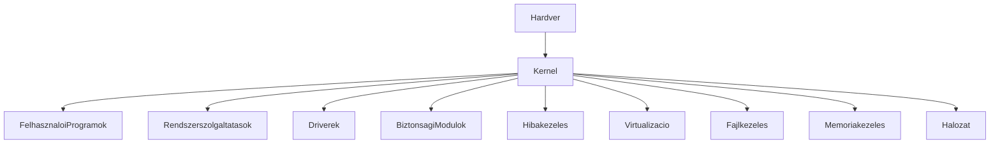
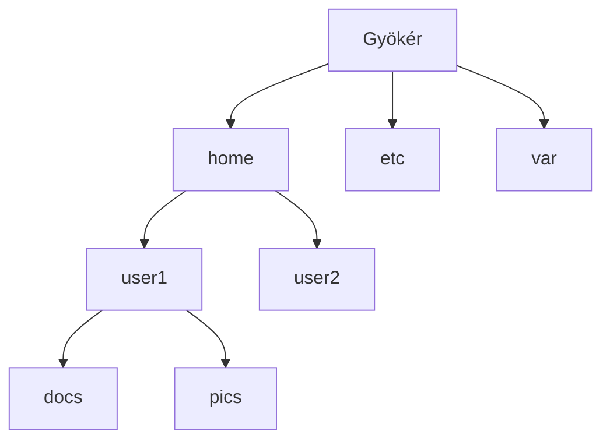
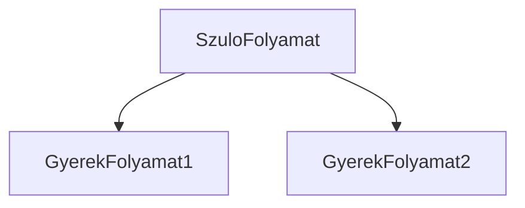
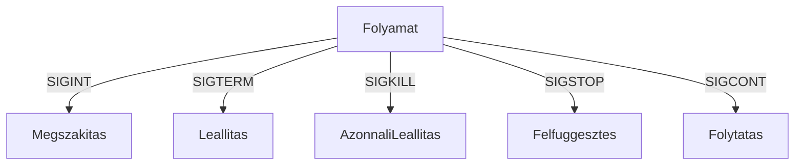
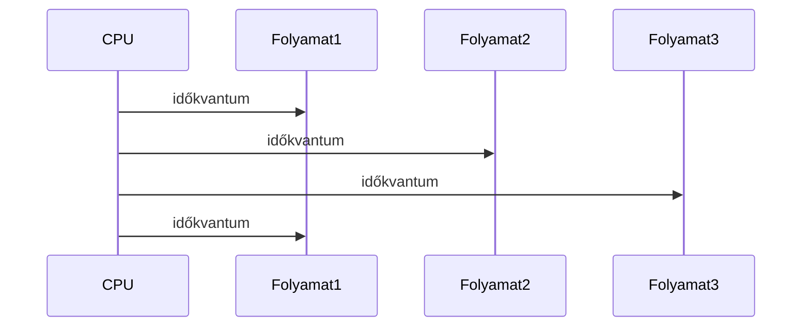

<div align="center">
	
</div>

---

<details>
<summary><b>🖥️ Operációs rendszerek fogalma, felépítése, osztályozásuk</b></summary>

# Operációs rendszerek – részletes kidolgozás

## 1. Fogalom, szerep, történet
Az operációs rendszer (OS) a számítógép legfontosabb szoftvere, amely a hardver és a felhasználói programok között közvetít. Fő feladatai:
- Erőforrások kezelése: CPU, memória, háttértár, perifériák
- Programok futtatása, vezérlése
- Biztonság, stabilitás, megbízhatóság
- Felhasználói élmény biztosítása
- Hardver absztrakció, interfész biztosítása

**Történeti áttekintés:**
- Első generáció: kötegelt rendszerek, lyukkártya, manuális vezérlés
- Második generáció: multiprogramozás, időosztás
- Harmadik generáció: interaktív rendszerek, GUI, multitasking
- Modern OS: virtualizáció, konténerizáció, felhő, mobil, IoT

## 2. Architektúra, fő modulok
Az OS architektúrája magában foglalja:
- Kernel (mag): közvetlenül kezeli a hardvert, folyamatokat, memóriát, eszközöket, rendszerhívásokat, védelmet, prioritásokat, szinkronizációt
- Felhasználói felület: CLI (parancssor), GUI (grafikus), webes, érintőképernyős, hangvezérelt
- Rendszerszolgáltatások: folyamatkezelés, memóriakezelés, fájlkezelés, hálózat, eszközkezelés, jogosultságkezelés, hibakezelés
- Modulok: driver-ek, protokoll stack-ek, biztonsági modulok, virtualizációs réteg, plug-in architektúra

**Ábra: Operációs rendszer architektúra (Mermaid)**


## 3. Kernel típusok és architektúrák
- Monolitikus kernel: minden funkció egyetlen nagy kernelben (Linux, Unix)
- Mikrokernel: csak alap funkciók a kernelben, többi modul külön (Minix, QNX, L4)
- Hibrid kernel: monolitikus és mikrokernel elemek keverve (Windows NT, macOS, XNU)
- Moduláris kernel: dinamikusan betölthető modulok, driver-ek (modern Linux, Solaris)
- Virtualizációs architektúra: Hypervisor, VM-ek, konténerizáció (Docker, LXC)

**Ábra: Kernel típusok összehasonlítása**


## 4. Osztályozás
- Felhasználók száma szerint: egyfelhasználós (MS-DOS), többfelhasználós (Linux, Unix, Windows Server), szerver OS, embedded (RTOS, Android Things)
- Feladatok száma szerint: egyfeladatos, többfeladatos (multitasking), párhuzamos, szimultán
- Időosztás szerint: valós idejű (RTOS), kötegelt (batch), interaktív, időosztásos (Unix, Linux)
- Architektúra szerint: monolitikus, mikrokernel, moduláris, hibrid, virtualizált

## 5. Modern trendek
- Virtualizáció, konténerizáció, felhő OS-ek (Kubernetes, OpenStack)
- Mobil OS-ek, IoT, edge computing
- Biztonság, patch management, zero trust

**Példák:**
- Windows, Linux, macOS, Unix, Android, iOS, FreeBSD, Solaris, z/OS, Chrome OS, QNX, Minix, OpenBSD

## 6. Vizsgatippek, workflow
- Mindig említsd a kernel szerepét, és hogy az OS hogyan kezeli az erőforrásokat!
- Rajzolj architektúra diagramot, mutasd be a fő modulokat!
- Példákkal illusztráld a tipikus hibákat és azok elkerülését!
- Hasonlítsd össze a kernel típusokat, mondj példákat!
- Ismerd a fő OS-eket, tudj legalább 3-at felsorolni!
- Workflow: probléma felismerése (monitoring, logok), diagnosztika (dmesg, syslog, top, ps), hiba lokalizálása (strace, lsof, netstat), megoldás (konfiguráció, restart, patch), dokumentálás, tanulságok

</details>

<details>
<summary><b>📁 Fájlok és fájlrendszerek</b></summary>

# Fájlok és fájlrendszerek – részletes kidolgozás

## 1. Fájl fogalma, attribútumai
A fájl az adatok elnevezett, tartós tárolási egysége. Minden fájlnak van:
- Neve
- Típusa (szöveg, bináris, program, kép, stb.)
- Mérete
- Jogosultsága (olvasás, írás, futtatás)
- Létrehozási, módosítási dátuma

## 2. Fájlrendszer fogalma, típusai
A fájlrendszer a fájlok szervezésének, tárolásának és elérésének módja. Lehet:
- Hierarchikus (Unix, Windows): könyvtárak, almappák
- Sík (régi rendszerek): minden fájl egy szinten

**Főbb fájlrendszerek:**
- FAT, NTFS (Windows)
- ext2, ext3, ext4 (Linux)
- HFS+, APFS (macOS)
- ZFS, XFS, Btrfs (haladó)

**Ábra: Fájlrendszer hierarchia**


## 3. Fájlműveletek
- Létrehozás, olvasás, írás, törlés, átnevezés
- Jogosultságok módosítása (chmod, chown)
- Fájlok listázása (ls, dir)
- Fájlok keresése (find, locate)
- Fájlok tömörítése (zip, tar, gzip)

**Példa (Unix parancsok):**
```sh
ls -l # fájlok listázása jogosultságokkal
chmod 644 file.txt # jogosultság módosítása
rm file.txt # törlés
```

## 4. Jogosultságkezelés
- Felhasználók, csoportok
- Olvasás, írás, futtatás jogok
- root/admin jogok
- ACL (Access Control List)

**Ábra: Jogosultságok Unix fájlrendszerben**


## 5. Tipikus hibák, hibaelhárítás
- Hibás jogosultság: nem lehet olvasni/írni
- Fájl elvesztése, sérülése
- Fájlműveletek helytelen használata
- Fájlok duplikációja, szimbolikus linkek félreértése

## 6. Vizsgatippek
- Írd le, hogy a fájlrendszer hogyan szervezi a fájlokat, és miért fontos a jogosultságkezelés!
- Mutass be példát fájlműveletekre, jogosultságok módosítására!

</details>

<details>
<summary><b>🔗 Speciális fájlok Unix alatt</b></summary>

# Speciális fájlok Unix alatt – részletes kidolgozás

## 1. Eszközfájlok
- Hardvereszközök elérése: /dev/sda (merevlemez), /dev/tty (terminál)
- Blokkeszközök: merevlemez, pendrive
- Karakteres eszközök: billentyűzet, egér

## 2. Nevezetes csővezetékek (FIFO)
- Tartós kommunikáció két folyamat között
- Létrehozás: mkfifo parancs
- Használat: írás, olvasás

## 3. Socket fájlok
- Hálózati kommunikáció, IPC
- Példa: /tmp/mysocket
- Használat: szerver-kliens kommunikáció

## 4. Symbolic link
- Hivatkozás más fájlra, nem másolat
- Létrehozás: ln -s eredeti.txt link.txt
- Törlés: csak a link törlődik, az eredeti nem

## 5. Speciális eszközfájlok
- /dev/null: "fekete lyuk", minden beleírt adat elveszik
- /dev/zero: null byte-ok generálása
- /dev/random: véletlen adatok generálása

**Ábra: Unix eszközfájlok**


## 6. Tipikus hibák
- Symbolic link törlése: csak a link törlődik, az eredeti nem
- Eszközfájlok jogosultságainak helytelen beállítása: adatvesztés, biztonsági kockázat
- FIFO nem olvasása: blokkolódó folyamat
- Socket fájl helytelen használata: kommunikációs hiba

## 7. Vizsgatippek
- Mindig említsd, hogy a Unixban minden eszköz fájlként érhető el!
- Írd le, hogy a /dev/null, /dev/zero, /dev/random mire használható!
- Mutass be példát symbolic linkre, FIFO-ra, socketre!

**Gyakorlati példák:**
```sh
ln -s eredeti.txt link.txt # szimbolikus link létrehozása
cat /dev/null # speciális eszközfájl használata
mkfifo mypipe # nevezetes csővezeték létrehozása
cat /dev/zero | head -c 10 # 10 null byte kiírása
cat /dev/random | head -c 8 # 8 random byte
```

</details>

<details>
<summary><b>➡️ Átirányítás, csővezetékek</b></summary>

# Átirányítás, csővezetékek – részletes kidolgozás

## 1. Átirányítás
- Standard bemenet (stdin): < – parancs bemenetét fájlból olvassa
- Standard kimenet (stdout): > – parancs kimenetét fájlba írja
- Standard hibakimenet (stderr): 2> – hibák kimenetét fájlba írja
- Több átirányítás: 1> kimenet.txt 2> hibak.txt

## 2. Csővezeték (pipe)
- | – két folyamat kimenetét/bemenetét összekapcsolja
- Az egyik kimenete a másik bemenete lesz
- Parancsok láncolása, automatizálás

**Ábra: Pipe működése**


## 3. Részletes magyarázat
Az átirányítás és pipe lehetővé teszi a parancsok kombinálását, automatizálását, hibakezelését. Ez a Unix filozófia egyik alapja: "minden parancs egy dolgot csinál jól". Pipe-ban bufferelés: nagy adatmennyiség esetén lassulás, késleltetés. Hibás szintaxis: > helyett >>, vagy 2> helyett &>. Több pipe egymás után: nehéz követni az adatfolyamot.

## 4. Tipikus hibák
- Hibakimenet átirányítása elfelejtve: hibaüzenetek nem látszanak, nehezebb hibakeresés
- Pipe-ban bufferelés: nagy adatmennyiség esetén lassulás, késleltetés
- Hibás szintaxis: > helyett >>, vagy 2> helyett &>
- Több pipe egymás után: nehéz követni az adatfolyamot

## 5. Vizsgatippek
- Írd le, hogy az átirányítás és pipe hogyan segíti a parancsok kombinálását!
- Mutass be példát hibakimenet átirányítására!
- Mutass be több pipe-ot egymás után!
- Magyarázd el, miért hasznos a parancsok láncolása!

**Gyakorlati példák:**
```sh
cat file.txt | grep "alma" > eredmeny.txt
ls -l > lista.txt 2> hibak.txt
cat file.txt | grep "alma" | sort | uniq > eredmeny.txt
echo "hiba" 1> kimenet.txt 2> hibak.txt
cat adat.txt | grep "error" | sort | uniq | tee errors.txt
```

</details>

<details>
<summary><b>⚙️ Folyamatkezelés</b></summary>

# Folyamatkezelés – részletes kidolgozás

## 1. Folyamat fogalma
A folyamat (process) futó program, saját memóriaterülettel, azonosítóval (PID), állapottal. Minden folyamatnak van szülője (parent), lehetnek gyerekfolyamatok (child).

## 2. Folyamatkezelés
- Létrehozás (fork, exec)
- Futtatás, felfüggesztés, leállítás
- Prioritás, ütemezés
- Kommunikáció (IPC: pipe, shared memory, message queue, signals)

**Ábra: Folyamatok szülő-gyerek viszonya**


## 3. Folyamatállapotok
- fut, várakozik, leállt, felfüggesztett, zombie, orphan

## 4. Tipikus hibák
- Zombie folyamat: szülő nem veszi át a kilépési státuszt
- Orphan folyamat: szülő megszűnik, init veszi át
- Véletlen kill: rossz PID
- Folyamatok túlzott száma: erőforrás-kimerülés

## 5. Vizsgatippek
- Mindig említsd a PID szerepét, és hogy a folyamatok hogyan kommunikálnak!
- Írd le, hogy a fork() és exec() hogyan működik, és mutass be szülő-gyerek folyamatot!
- Mutass példát IPC-re (pipe, shared memory, signals)!

**Gyakorlati példák:**
```sh
ps aux # folyamatok listázása
kill -9 1234 # folyamat leállítása
top # folyamatok figyelése
```

**Advanced példa (C):**
```c
pid_t pid = fork();
if (pid == 0) {
    // gyerek folyamat
    execlp("ls", "ls", NULL);
} else {
    // szülő folyamat
    wait(NULL);
}
```

</details>

<details>
<summary><b>📣 Jelzések, szignálok</b></summary>

# Jelzések, szignálok – részletes kidolgozás

## 1. Szignál fogalma
A szignál az OS vagy más folyamat által küldött esemény, amely megszakítja vagy módosítja a folyamat működését. Szignálokkal lehet folyamatokat vezérelni, kommunikálni, hibát jelezni.

## 2. Főbb szignálok
- SIGINT: megszakítás (Ctrl+C)
- SIGTERM: leállítás
- SIGKILL: azonnali leállítás (nem kezelhető)
- SIGSTOP: felfüggesztés (nem kezelhető)
- SIGCONT: folytatás

**Ábra: Szignálok hatása folyamatokra**


## 3. Signal handler
- Saját függvény, amelyet a folyamat hív meg szignál érkezésekor
- Példa: C-ben signal(SIGINT, handler)

## 4. Tipikus hibák
- SIGKILL használata: nem fut le a takarítás, erőforrások nem szabadulnak fel
- Signal handler helytelen implementációja: nem megfelelő hibakezelés
- Szignálok figyelmen kívül hagyása: nem reagál a folyamat

## 5. Vizsgatippek
- Írd le, hogy a szignálok hogyan segítik a folyamatok vezérlését!
- Mutass példát saját szignálkezelőre (signal handler)!
- Ismerd a főbb szignálokat, tudj példát mondani!

**Gyakorlati példák:**
```sh
kill -SIGSTOP 1234 # folyamat felfüggesztése
kill -SIGCONT 1234 # folytatás
```

**Advanced példa (C):**
```c
#include <signal.h>
void handler(int sig) {
    printf("Szignál érkezett: %d\n", sig);
}
signal(SIGINT, handler);
```

</details>

<details>
<summary><b>⏰ Ütemezett végrehajtás</b></summary>

# Ütemezett végrehajtás – részletes kidolgozás

## 1. Ütemezés fogalma
Az ütemezés (scheduling) az OS egyik legfontosabb feladata, mert meghatározza a rendszer teljesítményét, válaszidejét, igazságosságát. Preemptív ütemezés: az OS megszakíthatja a folyamatot. Nem-preemptív: a folyamat magától adja át a CPU-t.

## 2. Ütemezési algoritmusok
- FIFO: elsőként érkezett kap először CPU-t
- Round Robin: minden folyamat kap egy időkvantumot, körbe-körbe
- Prioritásos: magasabb prioritású folyamat előbb fut
- Valós idejű: garantált válaszidő, pl. RTOS

**Ábra: Round Robin ütemezés**


## 3. Részletes magyarázat
Az ütemezés meghatározza, melyik folyamat mikor kap CPU-t. Cél: hatékonyság, válaszidő, igazságosság, prioritás. Preemptív ütemezés lehetővé teszi, hogy az OS megszakítsa a folyamatot, ha lejár az időkvantum vagy magasabb prioritású folyamat érkezik. Nem-preemptív esetben a folyamat magától adja át a CPU-t.

## 4. Tipikus hibák
- Prioritás helytelen beállítása: starvation (éhezés, alacsony prioritású folyamat nem kap CPU-t)
- FIFO algoritmus: hosszú futású folyamatok blokkolják a rövideket
- Időkvantum túl rövid/hosszú: túl sok váltás vagy lassú válaszidő

## 5. Vizsgatippek
- Mindig említsd, hogy az ütemezés hogyan befolyásolja a rendszer teljesítményét!
- Írd le, hogy a Round Robin algoritmus hogyan működik, és mutass be időkvantumot!
- Hasonlítsd össze a preemptív és nem-preemptív ütemezést!

**Gyakorlati példák:**
```sh
nice -n 10 program # alacsonyabb prioritással futtatás
at 12:00 program # ütemezett futtatás
crontab -e # időzített feladatok beállítása
* * * * * echo "Hello" >> log.txt
```

</details>

---

<div align="center">
	
</div>