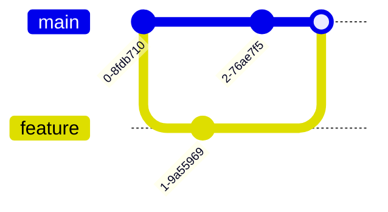
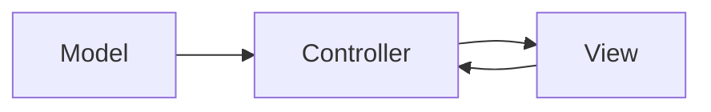

<div align="center">
    
</div>

---

<details>
<summary><b>🔄 Verziókezelés, verziókezelő rendszerek</b></summary>

**Verziókezelés:** A forráskód, dokumentáció, konfigurációk változásainak nyilvántartása, visszakövethetősége, együttműködés támogatása.

**Főbb rendszerek:** Git, Subversion (SVN), Mercurial, CVS

**Alapfogalmak:**
- **Repository:** a projekt teljes története
- **Commit:** változások rögzítése
- **Branch:** párhuzamos fejlesztési ág
- **Merge:** ágak egyesítése
- **Tag:** verzió megjelölése

---
**Részletes magyarázat, best practice, tipikus hibák, vizsgatippek, példák:**

Verziókezelés nélkül a fejlesztés kaotikus, nehéz visszakövetni, ki mit módosított. A Git elosztott, minden fejlesztőnél teljes repo van. Branch stratégia: pl. Git Flow, trunk-based development. Merge konfliktus: ha két fejlesztő ugyanazt a sort módosítja. Tag: kiadás, release verziók megjelölése. Rebase: történet újraírása.

**Best practice:**
- Használj jól definiált branch stratégiát (pl. Git Flow).
- Mindig oldd fel a merge konfliktusokat tudatosan.
- Tag-ekkel jelöld a kiadásokat.

**Tipikus hibák:**
- Merge konfliktusok
- Elveszett commitok (force push)
- Branch stratégia hiánya

**Vizsgatippek:**
- Írd le, hogy a verziókezelés hogyan segíti a csapatmunkát, és mutass be tipikus Git parancsokat!
- Mi a különbség a merge és a rebase között?
- Hogyan oldasz fel merge konfliktust?
- Mi a tag szerepe?

**Gyakorlati példa (Git):**
```sh
git init
git add .
git commit -m "Első commit"
git branch feature
git checkout feature
git merge main
git rebase main
git tag v1.0.0
git log --oneline --graph
```

**Ábra (Mermaid):**

</details>

---
<details>
<summary><b>🏛️ Architekturális minták (MVC, MVVM, MVP)</b></summary>

<b>Részletes magyarázat:</b>
Az MVC minta elválasztja az adatokat, a megjelenítést és a vezérlést. Model: üzleti logika, View: felhasználói felület, Controller: események kezelése. Előnye: könnyen tesztelhető, bővíthető, karbantartható. További minták: MVVM (ViewModel köztes réteg), MVP (Presenter vezérli a View-t).

<b>Tipikus vizsgakérdések:</b>
- Mi a különbség az MVC és MVVM között?
- Hogyan kommunikál a Controller a Modellel?
- Mikor érdemes MVP-t használni?

<b>Advanced példa (Django):</b>
```python
# views.py
def index(request):
	users = User.objects.all()
	return render(request, "index.html", {"users": users})
```

</details>

---
<details>
<summary><b>🔌 Függőség befecskendezés (Dependency Injection)</b></summary>

<b>Részletes magyarázat:</b>
DI: a függőségeket (pl. adatbázis, logger) nem az osztály hozza létre, hanem kívülről kapja. Ez tesztelhetővé, cserélhetővé teszi a komponenseket. DI keretrendszerek: Spring, Guice, .NET Core. Konstruktor, setter, interface injection.

<b>Tipikus vizsgakérdések:</b>
- Miért jobb a DI, mint a közvetlen példányosítás?
- Hogyan tesztelnél egy DI-s osztályt?
- Milyen DI típusokat ismersz?

<b>Advanced példa (Java, Spring):</b>
```java
@Component
class App {
	@Autowired
	Logger logger;
}
```

</details>

---
<details>
<summary><b>🧩 Objektum orientált tervezési alapelvek (GoF, SOLID)</b></summary>

<b>Részletes magyarázat:</b>
GoF minták: Singleton (egy példány), Factory (példányosítás elrejtése), Observer (értesítés), Strategy (algoritmus cserélhető), Decorator (funkció bővítése). SOLID: minden elv segíti a bővíthetőséget, tesztelhetőséget, karbantarthatóságot. Liskov: leszármazott osztály helyettesítheti a szülőt. Dependency Inversion: absztrakcióra építsünk, ne konkrétumra.

<b>Tipikus vizsgakérdések:</b>
- Miért fontos az SRP?
- Mutass be egy OCP példát!
- Mi a Liskov elv lényege?

<b>Advanced példa (Java, OCP):</b>
```java
interface Szamitas {
	int muvelet(int a, int b);
}
class Osszeg implements Szamitas {
	public int muvelet(int a, int b) { return a + b; }
}
class Kivon implements Szamitas {
	public int muvelet(int a, int b) { return a - b; }
}
```

</details>

---
<details>
<summary><b>🧪 Szoftvertesztelési alapfogalmak</b></summary>

<b>Részletes magyarázat:</b>
Unit teszt: egyetlen egység (függvény, osztály) tesztelése, gyors, izolált, automatikus. Integrációs teszt: komponensek együttműködése, pl. adatbázis, API, külső szolgáltatás. Rendszerteszt: teljes alkalmazás, valós környezet, minden komponens együtt. Elfogadási teszt: ügyfél vagy felhasználó validálja, hogy a rendszer megfelel-e az elvárásoknak. Tesztlefedettség: a kód hány százalékát fedik le tesztek (pl. statement, branch, path coverage). Mock: tesztben helyettesítő objektum, amely leválasztja a tesztelt egységet a külső függőségekről.

**Tesztelési típusok:**
- Feketedoboz teszt: csak a bemenetet és kimenetet vizsgálja, a belső működést nem.
- Fehérdoboz teszt: a belső logikát, ágakat, elágazásokat is teszteli.
- Határérték-elemzés: szélső értékek, tipikus hibák feltárása.
- Regressziós teszt: módosítás után ellenőrzi, hogy nem romlott-e el a működés.

**Tesztelési folyamat:**
1. Tesztesetek tervezése (mit, hogyan teszteljünk)
2. Tesztkód írása (unit, integrációs, rendszer)
3. Tesztek futtatása (automatikus vagy manuális)
4. Eredmények kiértékelése (sikeres, sikertelen, hibák)
5. Tesztlefedettség mérése

**Best practice:**
- Írj automatizált unit teszteket minden fontos logikára!
- Használj mock-okat a külső függőségek leválasztásához!
- Mérd a tesztlefedettséget, de ne csak a százalékra törekedj, hanem a kritikus logikát is teszteld!
- Dokumentáld a teszteseteket, hogy más is értse!

**Tipikus hibák:**
- Tesztlefedettség alacsony
- Csak happy path tesztelése, hibás esetek kihagyása
- Külső függőségek tesztelése mock nélkül
- Manuális tesztelés, automatizálás hiánya

**Vizsgatippek:**
- Írd le, mi a különbség a fekete- és fehérdoboz teszt között!
- Mutass be határérték-elemzést!
- Magyarázd el a mock szerepét!
- Mutass példát unit és integrációs tesztre!

**Gyakorlati példa (Python, mock):**
```python
from unittest.mock import Mock
db = Mock()
db.get_user.return_value = {"id": 1, "name": "Anna"}
assert db.get_user(1)["name"] == "Anna"
```
</details>

---

<details>
<summary><b>🧩 Objektum orientált tervezési alapelvek (GoF, SOLID)</b></summary>

**GoF (Gang of Four):** 23 klasszikus tervezési minta (Design Patterns), pl. Singleton, Factory, Observer, Strategy, Decorator.

**SOLID alapelvek:**
- **S**: Single Responsibility Principle (Egy felelősség elve)
- **O**: Open/Closed Principle (Nyitott/zárt elv)
- **L**: Liskov Substitution Principle (Helyettesíthetőség elve)
- **I**: Interface Segregation Principle (Interfész szétválasztás elve)
- **D**: Dependency Inversion Principle (Függőség megfordítás elve)

**Vizsgatipp:**
Írd le, hogy a SOLID elvek hogyan segítik a karbantarthatóságot, és mutass be példát!

**Gyakorlati példa (Java, SRP):**
```java
class Szamolo {
	int osszeg(int a, int b) { return a + b; }
}
class Kiir {
	void print(int x) { System.out.println(x); }
}
```

**Tipikus hibák:**
- Egy osztály túl sok felelősséget kap
- Interfészek túl általánosak
</details>

---

<details>
<summary><b>🔌 Függőség befecskendezés (Dependency Injection)</b></summary>

**Függőség befecskendezés:** Egy komponens (pl. osztály) külső erőforrásait (pl. adatbázis, logger) kívülről kapja meg, nem maga hozza létre.

**Előnyök:** tesztelhetőség, laza csatolás, újrahasznosíthatóság

**Vizsgatipp:**
Írd le, hogy a DI hogyan segíti a tesztelést, és mutass be példát!

**Gyakorlati példa (Java):**
```java
class Logger {
	void log(String msg) { System.out.println(msg); }
}
class App {
	private Logger logger;
	App(Logger logger) { this.logger = logger; }
	void fut() { logger.log("Futás"); }
}
```

**Tipikus hibák:**
- Függőségek közvetlen példányosítása
- DI keretrendszer helytelen használata
</details>

---

<details>
<summary><b>🏛️ Architekturális minták (MVC)</b></summary>

**MVC (Model-View-Controller):**
- **Model:** adatok, üzleti logika
- **View:** megjelenítés
- **Controller:** vezérlés, eseménykezelés

**Vizsgatipp:**
Rajzold le az MVC áramlást, és írd le, hogyan kommunikálnak a komponensek!

**Ábra (Mermaid):**


**Gyakorlati példa (pseudo):**
```python
# Model
class User:
	...
# View
def show_user(user):
	...
# Controller
def handle_request():
	user = get_user()
	show_user(user)
```
</details>

---


<details>
<summary><b>🧠 Tervezési minták</b></summary>

<b>Részletes magyarázat:</b>
Tervezési minták segítenek a tipikus szoftverproblémák megoldásában, újrahasznosítható, bevált megoldásokat adnak. GoF 23 klasszikus minta: Singleton (egy példány), Factory (példányosítás elrejtése), Observer (értesítés), Strategy (algoritmus cserélhető), Decorator (funkció bővítése futásidőben). Minták kombinálhatók, segítik a kód karbantarthatóságát, bővíthetőségét, tesztelhetőségét.

<b>Tipikus vizsgakérdések:</b>
- Miért veszélyes a Singleton?
- Mikor használnád az Observer mintát?
- Mi a különbség a Factory és a Strategy között?
- Hogyan kombinálnád a Decorator és Observer mintát?

<b>Vizsgatippek:</b>
- Írd le, hogy a minták hogyan segítik a kód újrahasznosítását!
- Mutass be legalább két mintát, példával!
- Magyarázd el, mikor melyik mintát érdemes használni!

<b>Gyakorlati példa (Java, Singleton):</b>
```java
class Singleton {
	private static Singleton instance;
	private Singleton() {}
	public static Singleton getInstance() {
		if (instance == null) instance = new Singleton();
		return instance;
	}
}
```

<b>Gyakorlati példa (Java, Observer):</b>
```java
interface Observer {
	void update();
}
class Subject {
	List<Observer> obs = new ArrayList<>();
	void addObs(Observer o) { obs.add(o); }
	void notifyAllObs() { for (Observer o : obs) o.update(); }
}
```

<b>Advanced példa (Java, Decorator):</b>
```java
interface Szamitas {
	int muvelet(int a, int b);
}
class Osszeg implements Szamitas {
	public int muvelet(int a, int b) { return a + b; }
}
class LogSzamitas implements Szamitas {
	private Szamitas szamitas;
	public LogSzamitas(Szamitas szamitas) { this.szamitas = szamitas; }
	public int muvelet(int a, int b) {
		System.out.println("Számolás");
		return szamitas.muvelet(a, b);
	}
}
```

</details>

---

<details>
<summary><b>🆓 Szabad és nem szabad szoftverek, licencek</b></summary>

**Szabad szoftver:** bárki szabadon használhatja, módosíthatja, terjesztheti. (pl. Linux, GIMP)

**Nem szabad szoftver:** felhasználás, módosítás, terjesztés korlátozott (pl. Windows, Photoshop)

**Szoftverlicencek:** jogi keret, amely meghatározza a felhasználás, módosítás, terjesztés feltételeit.

**Szabad és nyílt forrású licencek fajtái:**
- **GPL:** minden módosítás is szabad marad
- **MIT:** minimális korlátozás
- **Apache:** szabad, de védjegyek, szabadalmak védettek
- **BSD:** szabad, de felelősség kizárva
- **Creative Commons:** főleg tartalomra

**Vizsgatipp:**
Írd le, hogy a licencek hogyan befolyásolják a szoftver felhasználhatóságát, és mutass be példát!

**Gyakorlati példa:**
| Licenc | Felhasználás | Módosítás | Terjesztés |
|---|---|---|---|
| GPL | szabad | szabad | szabad, de GPL marad |
| MIT | szabad | szabad | szabad |
| Apache | szabad | szabad | szabad, szabadalmi védelem |
| BSD | szabad | szabad | szabad, felelősség kizárva |

<b>Részletes magyarázat:</b>
Szabad szoftver: négy szabadság (futtatás, tanulmányozás, módosítás, terjesztés). Nyílt forrású: forráskód elérhető, de nem feltétlenül szabad. GPL: copyleft, minden származék is szabad. MIT: minimális korlátozás, bárki használhatja. Apache: szabad, de szabadalmi védelem. BSD: felelősség kizárva. Creative Commons: tartalomra, nem szoftverre.

<b>Tipikus vizsgakérdések:</b>
- Mi a különbség a szabad és nyílt forrású szoftver között?
- Mit jelent a copyleft?
- Milyen licenceket ismersz?

<b>Advanced példa:</b>
```text
GPL: Linux kernel, GIMP
MIT: React, Flask
Apache: Hadoop, Spark
BSD: FreeBSD
```

</details>

---

<div align="center">
  
</div>