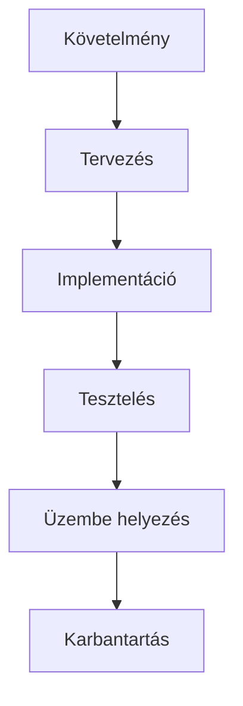
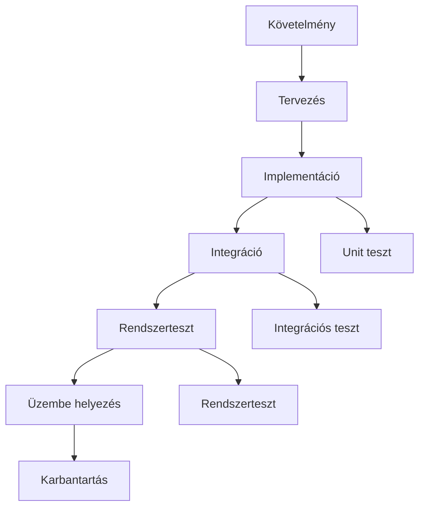
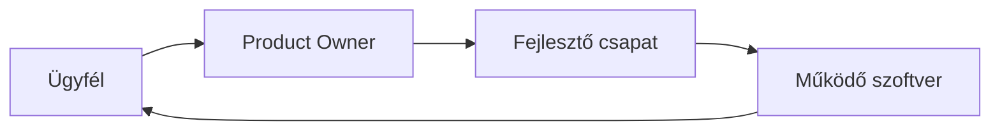
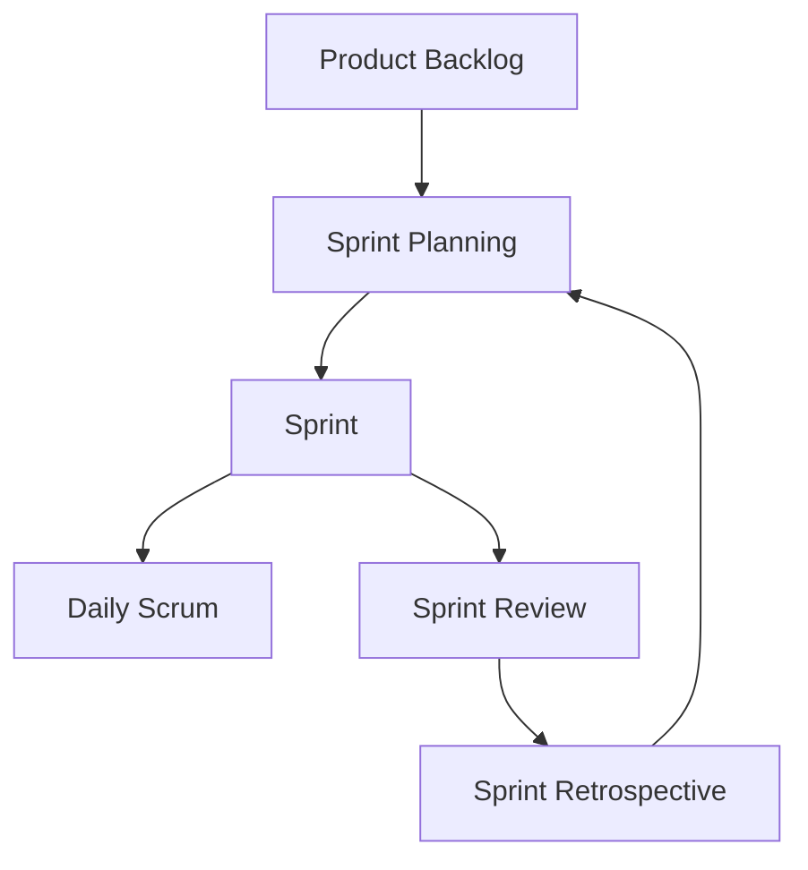
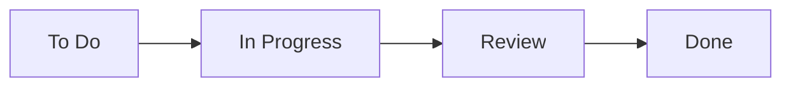

<div align="center">
    
</div>

---

<details>
<summary><b>🏛️ Hagyományos szoftverfejlesztési módszertanok</b></summary>

<b>Részletes magyarázat:</b>
A hagyományos modellek fő jellemzője a szigorú fázisok, a dokumentáció központi szerepe, és a változások nehéz kezelése. A vízesés modellnél minden fázis csak az előző lezárása után indulhat, ezért a hibák gyakran csak későn derülnek ki. A V-modell előnye, hogy a tesztelés már a tervezés során megjelenik, de a változtatások itt is nehezen vihetők végbe. A spirális modell a kockázatmenedzsmentre fókuszál, minden iterációban elemzi a lehetséges problémákat. A prototípus alapú fejlesztésnél a felhasználó aktívan részt vesz, de a végleges rendszer eltérhet a prototípustól. Az iteratív és inkrementális módszertanok lehetővé teszik a folyamatos fejlesztést, de a projektmenedzsment komplexebb. A RAD gyors eredményt ad, de a minőség és dokumentáció háttérbe szorulhat.

**Modellek és jellemzőik:**
- Vízesés modell: Szekvenciális, fázisok egymás után: követelmény → tervezés → implementáció → tesztelés → üzembe helyezés → karbantartás. Előnye: jól dokumentált, egyszerű menedzselni. Hátránya: nehéz változtatni, későn derülnek ki hibák.
- V-modell: Minden fejlesztési fázishoz tartozik egy tesztelési fázis. Előnye: tesztelés beépül a folyamatba. Hátránya: merev, nehezen reagál a változásokra.
- Spirális modell: Iteratív, kockázatelemzés minden ciklusban. Előnye: rugalmas, kockázatmenedzsment. Hátránya: komplex, nehezen menedzselhető.
- Prototípus alapú fejlesztés: Gyorsan készül egy működő prototípus, amit a felhasználó kipróbál. Előnye: visszacsatolás, igények pontosítása. Hátránya: végleges rendszer eltérhet a prototípustól.
- Iteratív/inkrementális: Több ciklusban, folyamatosan bővülő funkcionalitás. Előnye: folyamatos visszacsatolás, rugalmas változtatás. Hátránya: menedzsment komplexitás.
- RAD: Gyors alkalmazásfejlesztés, vizuális tervezés, gyors prototípusok. Előnye: gyors fejlesztés, felhasználói bevonás. Hátránya: dokumentáció hiánya, minőségi kompromisszumok.

**Összefoglaló táblázat:**
| Modell | Előny | Hátrány |
|---|---|---|
| Vízesés | Egyszerű, jól dokumentált | Rugalmatlan, késői hibák |
| V-modell | Tesztelés integrált | Merev, nehezen változtatható |
| Spirális | Kockázatmenedzsment | Komplex, drága |
| Prototípus | Gyors visszacsatolás | Végleges eltérhet |
| Iteratív/inkrementális | Rugalmas, folyamatos fejlesztés | Menedzsment nehéz |
| RAD | Gyors, felhasználói bevonás | Dokumentáció hiánya |

**Ábrák (Mermaid):**
Vízesés modell:

V-modell:


**Best practice:**
- Stabil követelményeknél válassz vízesés modellt.
- Ha a tesztelés kiemelten fontos, V-modell.
- Ha a felhasználói visszacsatolás kritikus, prototípus vagy iteratív.

**Tipikus hibák:**
- Túlzott dokumentáció, lassú reakció a változásokra
- Hibák csak későn derülnek ki (vízesés)
- Tesztelés elhanyagolása
- Prototípus félreértelmezése végleges rendszerként

**Vizsgatippek:**
- Mindig emeld ki, hogy a hagyományos modellekben a változtatás költséges!
- Rajzold le a modellek áramlását, mutasd be a fázisokat!
- Hasonlítsd össze a modelleket, mutass példát!

**Gyakorlati példa:**
Egy banki rendszer fejlesztésénél a vízesés modellt választják, mert a követelmények stabilak, a hibák viszont csak a tesztelési fázisban derülnek ki, ami költséges lehet.

**Advanced összehasonlító példa:**
| Modell | Mikor ajánlott? | Tipikus hiba |
|---|---|---|
| Vízesés | Stabil, jól definiált projektek | Hibák késői felismerése |
| V-modell | Biztonságkritikus rendszerek | Tesztelés túl későn |
| Spirális | Nagy, kockázatos projektek | Költség, komplexitás |
| Prototípus | Innovatív, új igények | Prototípus túlzott használata |
| Iteratív/inkrementális | Folyamatos fejlesztés | Menedzsment nehéz |
| RAD | Gyors eredmény, MVP | Minőség kompromisszum |
</details>

---

<details>
<summary><b>⚡️ Agilis szoftverfejlesztési módszertanok</b></summary>

### Az agilis szoftverfejlesztés alapjai
- Folyamatos együttműködés, gyors visszacsatolás, rugalmas változtatás.
- Kis, önszerveződő csapatok, iteratív fejlesztés.
- Működő szoftver a legfontosabb.

### Az agilis kiáltvány (Manifesto for Agile Software Development)

**4 alapérték:**
- Egyének és interakciók a folyamatok és eszközök helyett
- Működő szoftver az átfogó dokumentáció helyett
- Ügyfél együttműködés a szerződéses tárgyalás helyett
- Változásra való reagálás a terv követése helyett

**12 alapelv:**
1. Az ügyfél elégedettsége a legfontosabb
2. Változások elfogadása, akár későn is
3. Gyakori, működő szoftver szállítása
4. Napi együttműködés üzleti és fejlesztői oldal között
5. Motivált egyének, bizalom, támogatás
6. Személyes kommunikáció
7. Működő szoftver a haladás mércéje
8. Fenntartható fejlesztés
9. Technikai kiválóság, jó design
10. Egyszerűség
11. Ön-szerveződő csapatok
12. Rendszeres visszacsatolás, finomhangolás

**Ábra (Mermaid):**


### Scrum módszertan részletes bemutatása

**Szerepkörök:**
- Product Owner: üzleti igények, prioritások
- Scrum Master: folyamat facilitálása, akadályok elhárítása
- Fejlesztői csapat: implementáció

**Folyamat:**
1. Product Backlog: összes feladat, igény
2. Sprint Planning: sprint célok, feladatok kiválasztása
3. Sprint: 2-4 hetes fejlesztési ciklus
4. Daily Scrum: napi rövid egyeztetés
5. Sprint Review: eredmények bemutatása
6. Sprint Retrospective: tanulságok, fejlesztés

**Ábra (Mermaid):**


---
**Részletes magyarázat, best practice, tipikus hibák, vizsgatippek, példák:**

Az agilis módszertanok lényege a folyamatos visszacsatolás, a gyors alkalmazkodás, és a csapat önszerveződése. Az agilis kiáltvány 2001-ben született, és a szoftverfejlesztésben paradigmaváltást hozott: a dokumentáció helyett a működő szoftver, a szerződés helyett az ügyfél együttműködése, a terv helyett a változásra való reagálás került előtérbe. Az agilis csapatok iteratív sprintekben dolgoznak, minden sprint végén értékelik az eredményeket és tanulnak a hibákból. A Scrum a legelterjedtebb agilis keretrendszer, de létezik Kanban, XP (Extreme Programming), Crystal, stb.

**Best practice:**
- Sprint cél legyen világos, backlog priorizált
- Napi standup legyen rövid, fókuszált
- Retrospektívben valódi tanulságokat vonj le
- Kanbanban tartsd a WIP limitet, vizualizáld a folyamatot

**Tipikus hibák:**
- Sprint túltervezése, túl sok feladat
- Nincs valódi retrospektív, tanulás elmarad
- Product Owner nem elérhető
- Dokumentáció teljes elhagyása

**Vizsgatippek:**
- Mindig emeld ki az agilis kiáltvány 4 alapértékét!
- Rajzold le a Scrum folyamatot, magyarázd a szerepköröket!
- Hasonlítsd össze a Scrum és a vízesés modellt!
- Mutass be Kanban példát!

**Gyakorlati példa:**
```text
Egy webáruház fejlesztésénél Scrum-ot alkalmaznak. A Product Owner hetente priorizálja a backlogot, a fejlesztők 2 hetes sprintekben dolgoznak, minden nap rövid Daily Scrum van, a sprint végén Review és Retrospective.
```

**Advanced Scrum vs. Waterfall összehasonlítás:**
| Tulajdonság | Scrum | Vízesés |
|---|---|---|
| Fázisok | Iteratív, rövid sprintek | Szekvenciális, hosszú fázisok |
| Változáskezelés | Rugalmas, gyors | Nehézkes, költséges |
| Dokumentáció | Minimális, csak szükséges | Részletes, kötelező |
| Ügyfél bevonás | Folyamatos | Csak elején/végén |
| Hibakezelés | Gyors visszacsatolás | Késői felismerés |

**Kanban módszertan rövid bemutatása:**
Kanban a vizuális folyamatmenedzsmenten alapul. A feladatok (kártyák) oszlopokban mozognak: To Do → In Progress → Done. Nincs fix sprint, a csapat folyamatosan húzza be a feladatokat, a WIP (Work In Progress) limit segít elkerülni a túlterhelést.

**Ábra (Mermaid):**


**Advanced Kanban példa:**
```text
Egy support csapat Kanban táblát használ: minden beérkező ticket To Do-ba kerül, a fejlesztők húzzák be In Progress-be, majd Review után Done-ba. A WIP limit 3, így egyszerre csak 3 feladaton dolgoznak.
```
</details>

---

<div align="center">
    
</div>