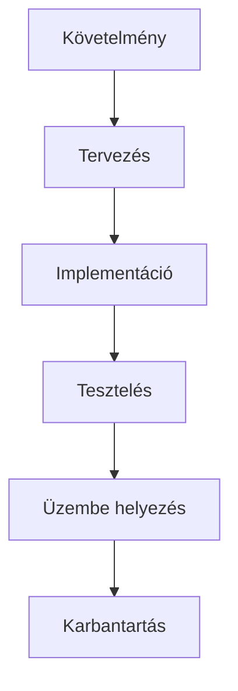
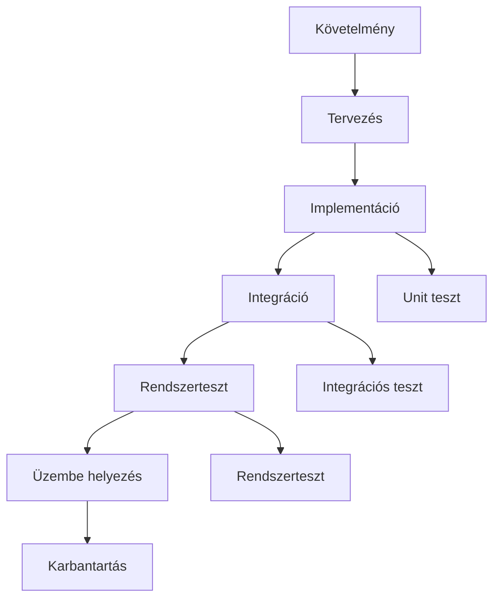
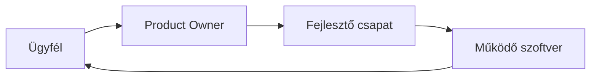

<div align="center">
	
</div>

---

# Szoftverfejlesztési módszertanok – Hagyományos és Agilis

## Hagyományos modellek – Mélyreható áttekintés

### Főbb jellemzők
- Szigorú, egymásra épülő fázisok (pl. követelmény, tervezés, implementáció, tesztelés, üzembe helyezés, karbantartás)
- Dokumentáció központi szerepe, minden lépéshez részletes leírás
- Változások kezelése nehézkes, költséges
- Hibák gyakran csak későn derülnek ki
- Projektmenedzsment hierarchikus, kevés visszacsatolás

### Modellek részletesen, példákkal, advanced összehasonlításokkal

- **Vízesés modell**
	- Szekvenciális, minden fázis csak az előző lezárása után indulhat
	- Előnyök: jól dokumentált, egyszerű menedzselni, stabil követelményeknél ideális
	- Hátrányok: rugalmatlan, hibák későn derülnek ki, változtatás költséges
	- Gyakorlati példa: banki rendszerek, repülőgép vezérlő szoftverek

- **V-modell**
	- Minden fejlesztési fázishoz tartozik egy tesztelési fázis
	- Előnyök: tesztelés integrált, biztonságkritikus rendszereknél ajánlott
	- Hátrányok: merev, nehezen reagál a változásokra, tesztelés költséges
	- Advanced példa: orvosi eszközök, autóipari vezérlők

- **Spirális modell**
	- Iteratív, minden ciklusban kockázatelemzés, prototípusok
	- Előnyök: rugalmas, kockázatmenedzsment, folyamatos visszacsatolás
	- Hátrányok: komplex, drága, nehezen menedzselhető
	- Példa: nagy, innovatív projektek, pl. űrkutatás

- **Prototípus alapú fejlesztés**
	- Gyorsan készül működő prototípus, felhasználói visszacsatolás
	- Előnyök: igények pontosítása, gyors eredmény
	- Hátrányok: végleges rendszer eltérhet, prototípus félreértelmezése
	- Példa: UI/UX fejlesztés, startup MVP

- **Iteratív/inkrementális**
	- Több ciklusban, folyamatosan bővülő funkcionalitás
	- Előnyök: rugalmas, folyamatos fejlesztés, visszacsatolás
	- Hátrányok: menedzsment komplexitás, scope creep veszélye
	- Példa: nagyvállalati ERP rendszerek

- **RAD (Rapid Application Development)**
	- Gyors fejlesztés, vizuális tervezés, prototípusok
	- Előnyök: gyors eredmény, felhasználói bevonás
	- Hátrányok: dokumentáció hiánya, minőségi kompromisszumok
	- Példa: belső üzleti alkalmazások

#### Összefoglaló táblázat

| Modell | Előny | Hátrány | Mikor ajánlott? | Tipikus hiba |
|---|---|---|---|---|
| Vízesés | Egyszerű, jól dokumentált | Rugalmatlan, késői hibák | Stabil, jól definiált projektek | Hibák késői felismerése |
| V-modell | Tesztelés integrált | Merev, nehezen változtatható | Biztonságkritikus rendszerek | Tesztelés túl későn |
| Spirális | Kockázatmenedzsment | Komplex, drága | Nagy, kockázatos projektek | Költség, komplexitás |
| Prototípus | Gyors visszacsatolás | Végleges eltérhet | Innovatív, új igények | Prototípus túlzott használata |
| Iteratív/inkrementális | Rugalmas, folyamatos fejlesztés | Menedzsment nehéz | Folyamatos fejlesztés | Menedzsment nehéz |
| RAD | Gyors, felhasználói bevonás | Dokumentáció hiánya | Gyors eredmény, MVP | Minőség kompromisszum |

#### Ábrák (Mermaid)

Vízesés modell:


V-modell:


#### Best practice, tipikus hibák, vizsgatippek

- Stabil követelményeknél vízesés modellt válassz
- Tesztelés kiemelten fontos: V-modell
- Felhasználói visszacsatolás kritikus: prototípus vagy iteratív
- Kerüld a túlzott dokumentációt, de ne hanyagold el teljesen
- Hibák csak későn derülnek ki (vízesés): tesztelési fázis hangsúlyos legyen
- Prototípus félreértelmezése végleges rendszerként: mindig hangsúlyozd a különbséget
- Rajzold le a modellek áramlását, mutasd be a fázisokat
- Hasonlítsd össze a modelleket, mutass példát

#### Advanced gyakorlati példák

- Banki rendszer: vízesés modell, stabil követelmények, hibák teszteléskor
- Orvosi eszköz: V-modell, minden fejlesztési lépéshez tesztelés
- Startup MVP: prototípus alapú fejlesztés, gyors visszacsatolás
- Nagyvállalati ERP: iteratív/inkrementális, folyamatos fejlesztés

---

## Agilis módszertanok – Mélyreható, összefésült áttekintés

### Alapelvek, kiáltvány, advanced magyarázat

- Folyamatos együttműködés, gyors visszacsatolás, rugalmas változtatás
- Kis, önszerveződő csapatok, iteratív fejlesztés, folyamatos tanulás
- Működő szoftver a legfontosabb, dokumentáció csak szükséges mértékben
- Ügyfél bevonása, napi kommunikáció, motivált egyének
- Változások elfogadása, akár későn is
- Technikai kiválóság, jó design, egyszerűség
- Fenntartható fejlesztés, rendszeres visszacsatolás, finomhangolás

#### Az agilis kiáltvány 4 alapértéke

- Egyének és interakciók a folyamatok és eszközök helyett
- Működő szoftver az átfogó dokumentáció helyett
- Ügyfél együttműködés a szerződéses tárgyalás helyett
- Változásra való reagálás a terv követése helyett

#### 12 alapelv – listában, példákkal

1. Ügyfél elégedettsége a legfontosabb – folyamatos szállítás
2. Változások elfogadása, akár későn is – rugalmas tervezés
3. Gyakori, működő szoftver szállítása – minimum 2-4 hetente
4. Napi együttműködés üzleti és fejlesztői oldal között – standupok
5. Motivált egyének, bizalom, támogatás – csapatépítés
6. Személyes kommunikáció – face-to-face, online meeting
7. Működő szoftver a haladás mércéje – demo, review
8. Fenntartható fejlesztés – tempó, burnout elkerülése
9. Technikai kiválóság, jó design – refaktorálás, tesztelés
10. Egyszerűség – csak a szükséges funkciók
11. Ön-szerveződő csapatok – felelősség, önállóság
12. Rendszeres visszacsatolás, finomhangolás – retrospektív

#### Ábra (Mermaid)


### Scrum, Kanban, XP, Crystal, Lean, DevOps – advanced, összefésült magyarázat

- **Scrum**
	- Szerepkörök: Product Owner (prioritás, üzleti igények), Scrum Master (facilitálás, akadályok elhárítása), Fejlesztői csapat (implementáció)
	- Folyamat: Product Backlog → Sprint Planning → Sprint (2-4 hét) → Daily Scrum → Sprint Review → Sprint Retrospective
	- Ábra:
	```mermaid
	flowchart TD
		A[Product Backlog] --> B[Sprint Planning]
		B --> C[Sprint]
		C --> D[Daily Scrum]
		C --> E[Sprint Review]
		E --> F[Sprint Retrospective]
		F --> B
	```
	- Best practice: világos sprint cél, priorizált backlog, rövid standup, valódi retrospektív
	- Tipikus hibák: sprint túltervezése, Product Owner nem elérhető, dokumentáció teljes elhagyása
	- Advanced példa: webáruház fejlesztés, 2 hetes sprintek, folyamatos review

- **Kanban**
	- Vizuális folyamatmenedzsment, feladatok kártyákon, oszlopokban: To Do → In Progress → Review → Done
	- Nincs fix sprint, folyamatos feladatfelvétel, WIP limit (max. párhuzamos feladat)
	- Ábra:
	```mermaid
	flowchart LR
		A[To Do] --> B[In Progress]
		B --> C[Review]
		C --> D[Done]
	```
	- Best practice: WIP limit tartása, folyamat vizualizálása, bottleneckek kezelése
	- Tipikus hibák: túl sok párhuzamos feladat, nem frissül a tábla
	- Advanced példa: support csapat, ticketek, WIP limit 3

- **XP (Extreme Programming)**
	- Páros programozás, folyamatos integráció, tesztvezérelt fejlesztés (TDD), refaktorálás
	- Rövid iterációk, ügyfél folyamatos bevonása
	- Best practice: automatizált tesztek, code review, gyakori release
	- Tipikus hibák: tesztelés elhanyagolása, túlzott refaktorálás

- **Crystal**
	- Személyre szabott agilis módszertan, csapat méretétől és projekt kritikus voltától függően
	- Fókusz: kommunikáció, emberek, folyamatos fejlesztés

- **Lean**
	- Felesleges lépések, veszteségek minimalizálása, értékteremtés maximalizálása
	- Folyamatos fejlesztés, Kaizen, pull rendszer

- **DevOps**
	- Fejlesztés és üzemeltetés integrációja, CI/CD, automatizált tesztelés, monitoring
	- Gyors release, folyamatos visszacsatolás, infrastruktúra mint kód

#### Advanced Scrum vs. Waterfall összehasonlítás

| Tulajdonság | Scrum | Vízesés |
|---|---|---|
| Fázisok | Iteratív, rövid sprintek | Szekvenciális, hosszú fázisok |
| Változáskezelés | Rugalmas, gyors | Nehézkes, költséges |
| Dokumentáció | Minimális, csak szükséges | Részletes, kötelező |
| Ügyfél bevonás | Folyamatos | Csak elején/végén |
| Hibakezelés | Gyors visszacsatolás | Késői felismerés |

#### Best practice, tipikus hibák, vizsgatippek – agilis

- Sprint cél legyen világos, backlog priorizált
- Napi standup legyen rövid, fókuszált
- Retrospektívben valódi tanulságokat vonj le
- Kanbanban tartsd a WIP limitet, vizualizáld a folyamatot
- XP-ben automatizált tesztek, páros programozás
- Lean: felesleges lépések minimalizálása
- DevOps: CI/CD, monitoring, gyors release
- Tipikus hibák: sprint túltervezése, tanulás elmarad, Product Owner nem elérhető, dokumentáció teljes elhagyása
- Vizsgatippek: mindig emeld ki az agilis kiáltvány 4 alapértékét, rajzold le a Scrum folyamatot, magyarázd a szerepköröket, hasonlítsd össze a Scrum és a vízesés modellt, mutass be Kanban példát

#### Advanced gyakorlati példák

- Webáruház fejlesztés: Scrum, 2 hetes sprintek, folyamatos review
- Support csapat: Kanban tábla, WIP limit, ticketek
- Startup: XP, TDD, folyamatos release
- Nagyvállalat: DevOps, CI/CD pipeline, monitoring

---

<div align="center">
	
</div>