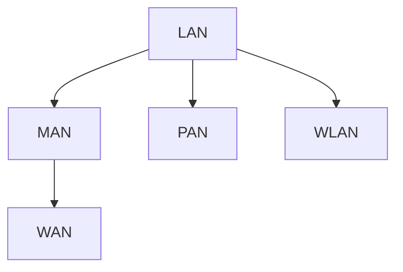
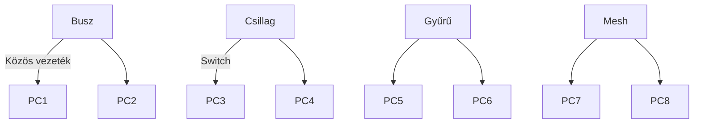
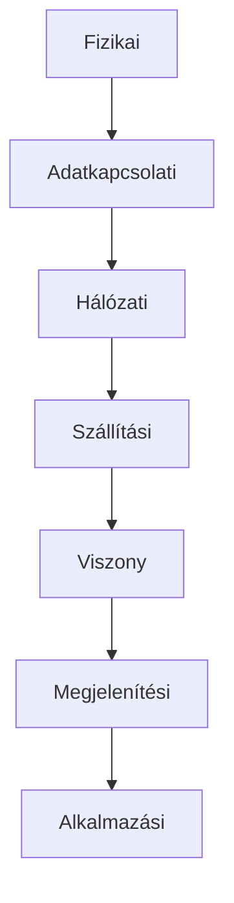
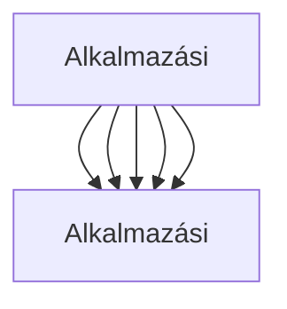
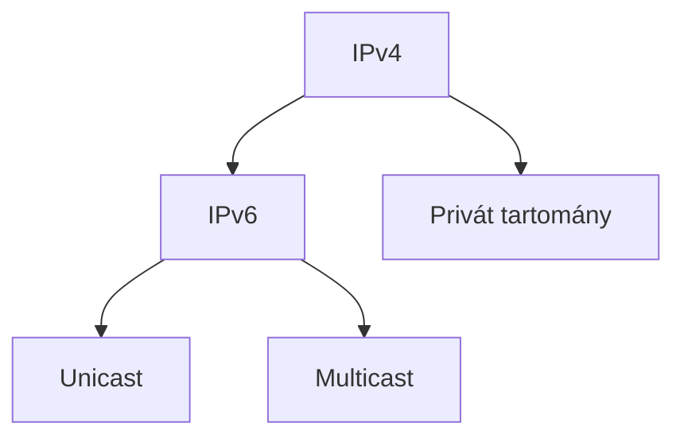
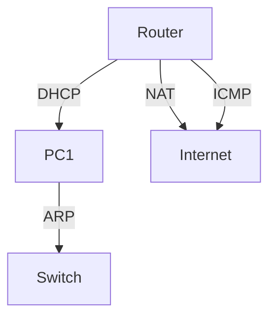
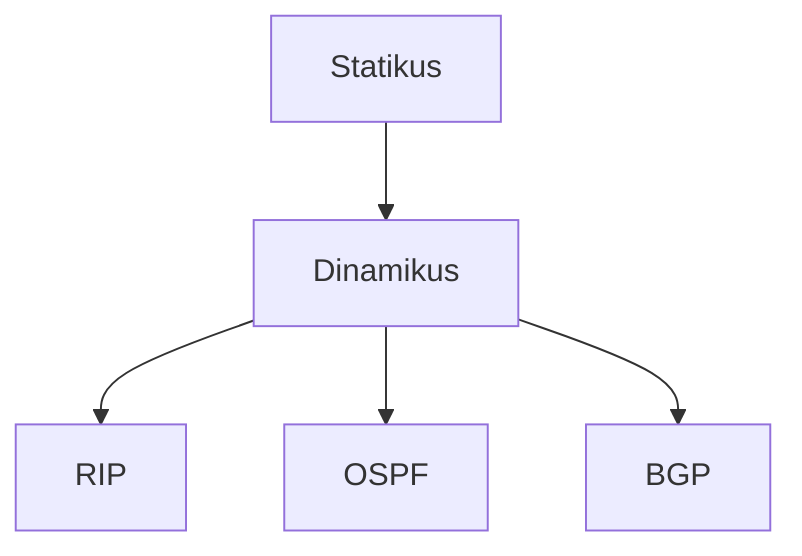
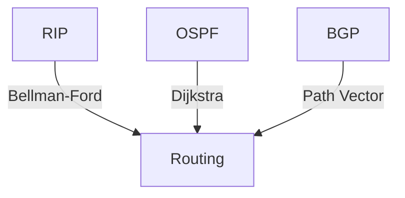
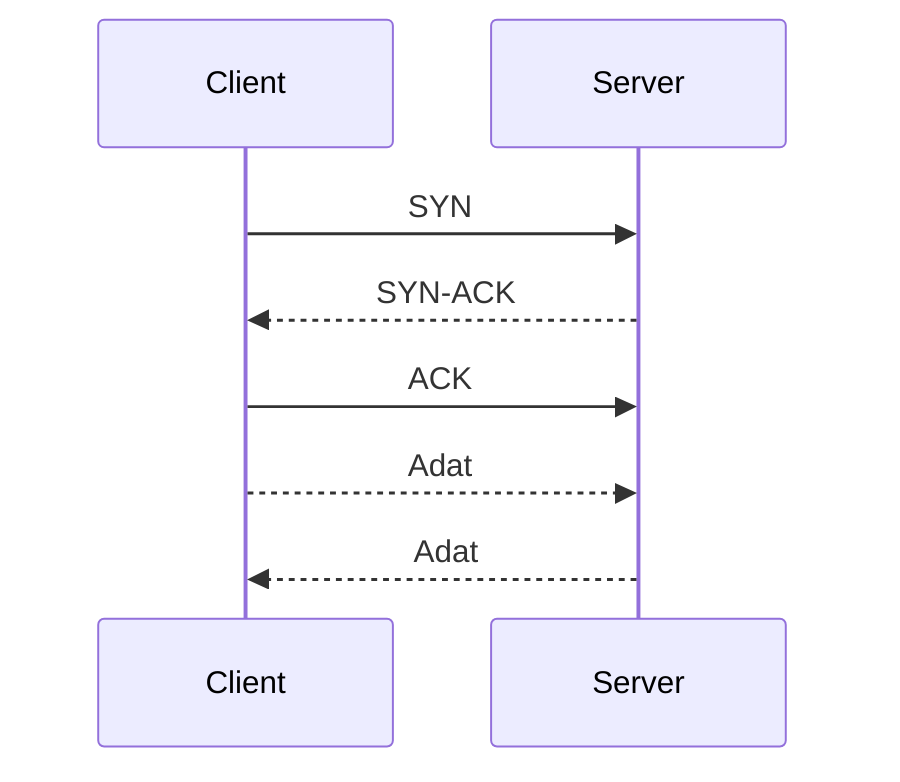
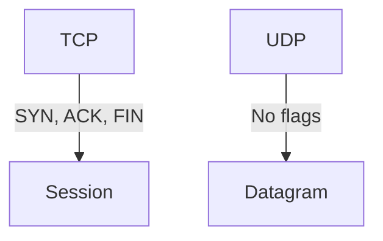

<div align="center">
  
</div>

---

<details>
<summary><b>🌍 Számítógép-hálózatok osztályozási szempontjai</b></summary>

<b>Részletes magyarázat:</b>
A hálózatokat méret, földrajzi kiterjedés, topológia, funkció, technológia, fizikai közeg, protokoll, biztonság szerint osztályozzuk. LAN tipikusan Ethernetet, Wi-Fi-t használ, gyors, de korlátozott kiterjedésű. MAN optikai vagy vezetékes technológiákat alkalmaz, városi szintű összeköttetést biztosít. WAN lehet bérelt vonal, MPLS, VPN, az internet is WAN. PAN Bluetooth, ZigBee, NFC technológiákat használ. WLAN a Wi-Fi szabványokra épül (802.11a/b/g/n/ac/ax).

**Főbb típusok:**
- LAN (Local Area Network): helyi hálózat, pl. iroda, iskola
- MAN (Metropolitan Area Network): városi hálózat
- WAN (Wide Area Network): országos, nemzetközi hálózat
- PAN (Personal Area Network): személyes eszközök (Bluetooth)
- WLAN (Wireless LAN): vezeték nélküli helyi hálózat

**Topológiák:**
- Busz (egy közös vezeték)
- Csillag (központi switch)
- Gyűrű (token ring)
- Fa (hierarchikus)
- Mesh (mindenki mindenkivel)

**Hálózati eszközök:**
- Hub: egyszerű jeltovábbító
- Switch: kereteket MAC cím alapján továbbít
- Router: IP cím alapján irányít
- Access Point: vezeték nélküli hozzáférés
- Bridge, Gateway, Firewall

**Ábrák (Mermaid):**
Típusok:

Topológiák:


**Best practice:**
- Mindig a felhasználási célhoz válassz hálózati típust és topológiát.
- Switch-et használj hub helyett
- Mesh topológiát kritikus rendszerekhez
- Titkosítsd a WLAN-t (WPA3)

**Tipikus hibák:**
- Nem megfelelő topológia választás
- Hálózati eszközök inkompatibilitása
- Helytelen eszközválasztás (pl. hub vs switch)
- Nem megfelelő kábelezés (UTP, STP, optika)
- Interferencia WLAN-nál
- Biztonsági hiányosságok (nyitott Wi-Fi)

**Vizsgatippek:**
- Rajzold le a főbb topológiákat!
- Magyarázd el a LAN, WAN, MAN különbségét!

**Advanced példa:**
Egy nagyvállalat WAN-t használ, több telephelyet köt össze, helyi szinten LAN-ok működnek, a dolgozók laptopjai WLAN-on keresztül csatlakoznak.

**Advanced topológia példa:**
| Topológia | Előny | Hátrány | Példa |
|---|---|---|---|
| Busz | Olcsó, egyszerű | Hiba esetén minden leáll | Régi Ethernet |
| Csillag | Könnyen bővíthető | Switch hibája kritikus | Modern LAN |
| Gyűrű | Sorrend garantált | Token elveszhet | Token Ring |
| Mesh | Redundáns, megbízható | Drága, komplex | Adatközpont |
| Fa | Hierarchikus | Root hiba kritikus | Nagyvállalati LAN |
</details>

---

<details>
<summary><b>🧩 Hálózati rétegmodellek</b></summary>

**OSI modell (7 réteg):**
1. Fizikai
2. Adatkapcsolati
3. Hálózati
4. Szállítási
5. Viszony
6. Megjelenítési
7. Alkalmazási

**TCP/IP modell (4 réteg):**
1. Hálózati hozzáférés
2. Internet
3. Szállítási
4. Alkalmazási

**Ábra (Mermaid):**


**Összehasonlító táblázat:**
| OSI réteg | TCP/IP réteg | Funkció |
|---|---|---|
| Fizikai, Adatkapcsolati | Hálózati hozzáférés | Bitátvitel, keretek |
| Hálózati | Internet | Címzés, útvonalválasztás |
| Szállítási | Szállítási | Megbízhatóság, adatfolyam |
| Viszony, Megjelenítési, Alkalmazási | Alkalmazási | Adatmegjelenítés, alkalmazások |

**Tipikus hibák:**
- Rétegek összekeverése
- Nem megfelelő protokoll választás

**Vizsgatipp:**
- Rajzold le az OSI modellt!
- Magyarázd el a TCP/IP és OSI közti különbséget!

**Best practice:**
- Rétegek elválasztása segíti a hibakeresést és fejlesztést.

**Advanced példa:**
```text
Az Ethernet a fizikai és adatkapcsolati réteghez tartozik, az IP a hálózati, a TCP a szállítási, a HTTP az alkalmazási réteg protokollja.
```

**Részletes magyarázat:**

Az OSI modell minden rétege külön funkciót lát el: fizikai (kábelek, jelek), adatkapcsolati (MAC, keretek, hibajavítás), hálózati (IP címzés, routing), szállítási (TCP/UDP, portok, megbízhatóság), viszony (titkosítás, session), megjelenítési (adatábrázolás, kódolás), alkalmazási (HTTP, FTP, SMTP, DNS). A TCP/IP modell egyszerűsített, a gyakorlatban elterjedt. Protokollok: Ethernet, Wi-Fi, PPP, IP, ICMP, ARP, TCP, UDP, DNS, DHCP, HTTP, SMTP, SNMP, SSH, TLS.

**Ábra: OSI vs TCP/IP**


**Tipikus hibák (mélyen):**
- Protokollok összekeverése (pl. IP vs TCP)
- Hibás porthasználat
- Layer violation (pl. alkalmazás közvetlenül fizikai réteget használ)

**Best practice (mélyen):**
- Rétegek szétválasztása, moduláris fejlesztés
- Hibakeresés rétegenként

**Advanced protokoll példa:**
| Réteg | Protokoll | Funkció |
|---|---|---|
| Fizikai | Ethernet, Wi-Fi | Jelek, kábelek |
| Adatkapcsolati | MAC, PPP | Keretek, hibajavítás |
| Hálózati | IP, ICMP, ARP | Címzés, routing, hibakezelés |
| Szállítási | TCP, UDP | Portok, megbízhatóság |
| Alkalmazási | HTTP, FTP, DNS | Adatátvitel, szolgáltatás |
</details>

---

<details>
<summary><b>🗺️ IP technológia címzési rendszere és vezérlése</b></summary>

**IP cím:** Egyedi azonosító a hálózaton (IPv4: 32 bit, IPv6: 128 bit)

**IPv4 felépítése:**
- 4 oktett, pl. 192.168.1.1
- Osztályok: A, B, C, D, E
- Privát tartományok: 10.0.0.0/8, 172.16.0.0/12, 192.168.0.0/16

**IPv6 felépítése:**
- Hexadecimális, pl. 2001:0db8:85a3:0000:0000:8a2e:0370:7334

**Címzési módok:**
- Unicast, broadcast, multicast, anycast

**Ábra (Mermaid):**


**IP vezérlés:**
- DHCP: dinamikus címkiosztás
- NAT: címfordítás
- ARP: MAC cím lekérdezés
- ICMP: hibakezelés, ping

**Tipikus hibák:**
- IP cím ütközés
- Hibás alhálózati maszk
- NAT konfigurációs hiba

**Vizsgatipp:**
- Rajzold le az IPv4 és IPv6 cím szerkezetét!
- Magyarázd el a DHCP és NAT szerepét!

**Best practice:**
- Használj privát IP-t belső hálózaton, NAT-ot internethez.

**Advanced példa:**
```text
Egy otthoni router DHCP-vel oszt ki IP-t, NAT-tal fordítja a belső címeket, ARP-vel deríti ki a MAC címeket, ICMP-vel ellenőrzi az elérhetőséget.
```

**Részletes magyarázat:**

Az IP címek hierarchikusak, subnetekre oszthatók (pl. 192.168.1.0/24). A címzési rendszer lehet statikus vagy dinamikus (DHCP). A NAT (Network Address Translation) lehet source NAT, destination NAT, port forwarding. Az ARP (Address Resolution Protocol) MAC címeket keres IP alapján, az ICMP (Internet Control Message Protocol) hibákat, elérhetőséget jelez (ping, traceroute). Az IPv6 nagyobb címteret, jobb biztonságot, egyszerűbb fejléceket ad. Multicastot streaminghez, anycastot redundanciához használják. CIDR (Classless Inter-Domain Routing) rugalmasabb címzést tesz lehetővé.

**Ábra: IP címzés, NAT, DHCP**


**Tipikus hibák (mélyen):**
- Hibás subnet mask (pl. 255.255.0.0 helyett 255.255.255.0)
- IP cím ütközés DHCP-nél
- NAT loopback hiba
- ARP spoofing támadás

**Best practice (mélyen):**
- Használj CIDR-t, subnettinget
- ARP-t védd (pl. dynamic ARP inspection)
- ICMP-t monitorozd, de korlátozd

**Advanced IP példa:**
| Protokoll | Funkció | Példa |
|---|---|---|
| DHCP | Dinamikus IP kiosztás | 192.168.1.100 |
| NAT | Címfordítás | 192.168.1.100 → 85.123.45.67 |
| ARP | MAC lekérdezés | ARP request/response |
| ICMP | Hibakezelés | ping, traceroute |
</details>

---

<details>
<summary><b>🚦 Forgalomirányítás elve és útválasztási kategóriák</b></summary>



**Útválasztási kategóriák:**
- Distance-vector: útvonal költsége alapján (RIP)
- Link-state: hálózati állapot alapján (OSPF)
- Path-vector: útvonalak teljes leírása (BGP)

**Tipikus hibák:**
- Hurok (loop) kialakulása
- Hibás routing tábla

**Vizsgatipp:**
- Magyarázd el a statikus és dinamikus routing közti különbséget!
- Sorold fel a főbb routing protokollokat!

**Best practice:**
- Nagy hálózatban dinamikus routingot használj, kis hálózatban statikust.

**Advanced példa:**
```text
Egy internetszolgáltató BGP-t használ a globális útvonalakhoz, az irodai hálózatban OSPF fut, a kis otthoni hálózatban statikus routing van.
```

**Részletes magyarázat:**

Routing algoritmusok: Dijkstra (OSPF), Bellman-Ford (RIP), path vector (BGP). A routing tábla tartalmazza a célhálózatokat, következő hop-ot, metrikát (költség, sávszélesség, késleltetés). A dinamikus routing protokollok frissítik a táblákat, detektálják a hibákat, optimalizálják az útvonalakat. A statikus routingot kis hálózatban, dinamikusat nagyban használják. A BGP az internet gerinchálózatának alapja, OSPF belső hálózatokhoz, RIP egyszerűbb, de lassabb.

**Ábra: Routing algoritmusok**


**Tipikus hibák (mélyen):**
- Routing loop (adat körbe megy)
- Hibás metrika, lassú konvergencia
- BGP hijack támadás

**Best practice (mélyen):**
- Routing tábla monitorozása
- Loop prevention (split horizon, poison reverse)
- BGP session védelme (MD5 auth)

**Advanced routing példa:**
| Protokoll | Algoritmus | Használat |
|---|---|---|
| RIP | Bellman-Ford | Kis LAN |
| OSPF | Dijkstra | Nagyvállalati LAN |
| BGP | Path Vector | Internet |

---

**Forgalomirányítás (routing):** Az adatcsomagok útjának meghatározása a hálózaton.

**Statikus útválasztás:**
- Adminisztrátor állítja be, fix útvonalak
- Előny: egyszerű, kis hálózatban
- Hátrány: nem rugalmas, hiba esetén manuális beavatkozás

**Dinamikus útválasztás:**
- Protokollok: RIP, OSPF, BGP, EIGRP
- Előny: automatikus, nagy hálózatban
- Hátrány: komplex, erőforrásigényes

**Ábra (Mermaid):**


**Útválasztási kategóriák:**
- Distance-vector: útvonal költsége alapján (RIP)
- Link-state: hálózati állapot alapján (OSPF)
- Path-vector: útvonalak teljes leírása (BGP)

**Tipikus hibák:**
- Hurok (loop) kialakulása
- Hibás routing tábla

**Vizsgatipp:**
- Magyarázd el a statikus és dinamikus routing közti különbséget!
- Sorold fel a főbb routing protokollokat!

**Best practice:**
- Nagy hálózatban dinamikus routingot használj, kis hálózatban statikust.

**Advanced példa:**
```text
Egy internetszolgáltató BGP-t használ a globális útvonalakhoz, az irodai hálózatban OSPF fut, a kis otthoni hálózatban statikus routing van.
```

**Részletes magyarázat:**

Routing algoritmusok: Dijkstra (OSPF), Bellman-Ford (RIP), path vector (BGP). A routing tábla tartalmazza a célhálózatokat, következő hop-ot, metrikát (költség, sávszélesség, késleltetés). A dinamikus routing protokollok frissítik a táblákat, detektálják a hibákat, optimalizálják az útvonalakat. A statikus routingot kis hálózatban, dinamikusat nagyban használják. A BGP az internet gerinchálózatának alapja, OSPF belső hálózatokhoz, RIP egyszerűbb, de lassabb.

**Ábra: Routing algoritmusok**


**Tipikus hibák (mélyen):**
- Routing loop (adat körbe megy)
- Hibás metrika, lassú konvergencia
- BGP hijack támadás

**Best practice (mélyen):**
- Routing tábla monitorozása
- Loop prevention (split horizon, poison reverse)
- BGP session védelme (MD5 auth)

**Advanced routing példa:**
| Protokoll | Algoritmus | Használat |
|---|---|---|
| RIP | Bellman-Ford | Kis LAN |
| OSPF | Dijkstra | Nagyvállalati LAN |
| BGP | Path Vector | Internet |
</details>

---

<details>
<summary><b>🔗 TCP és UDP mechanizmusok</b></summary>

**TCP (Transmission Control Protocol):**
- Kapcsolatorientált, megbízható
- Sorrendhelyes, hibajavító
- Háromlépcsős kézfogás (SYN, SYN-ACK, ACK)
- Áramlásvezérlés, torlódáskezelés
- Portok: 0-65535

**UDP (User Datagram Protocol):**
- Kapcsolat nélküli, gyors
- Nem garantált sorrend, hibajavítás
- Egyszerű fejlécek
- Portok: 0-65535

**Ábra (Mermaid):**


**TCP vs UDP összehasonlító táblázat:**
| Tulajdonság | TCP | UDP |
|---|---|---|
| Kapcsolat | Van | Nincs |
| Megbízhatóság | Garantált | Nem garantált |
| Sorrend | Megőrzött | Nem garantált |
| Sebesség | Lassabb | Gyorsabb |
| Használat | Web, email, FTP | Streaming, DNS, VoIP |

**Tipikus hibák:**
- TCP port ütközés
- UDP csomagvesztés

**Vizsgatipp:**
- Rajzold le a TCP kézfogást!
- Magyarázd el a TCP és UDP közti különbséget!

**Best practice:**
- TCP-t használj, ha fontos a megbízhatóság, UDP-t, ha a sebesség.

**Advanced példa:**
```text
A web böngészés TCP-t használ (HTTP), a videóstream UDP-t (RTP), DNS lekérdezés UDP-n keresztül történik, de nagy válasz esetén TCP-re vált.
```

**Részletes magyarázat:**

TCP megbízható, sorrendhelyes, hibajavító: sequence number, acknowledgment, window size, retransmission, flow control, congestion control. TCP flag-ek: SYN, ACK, FIN, RST, PSH, URG. TCP session: háromlépcsős kézfogás, kapcsolat bontás. UDP egyszerű, nincs kapcsolat, nincs hibajavítás, gyors, streaminghez ideális. UDP fejléce: source port, dest port, length, checksum. TCP portok: 80 (HTTP), 443 (HTTPS), 22 (SSH), UDP portok: 53 (DNS), 123 (NTP), 161 (SNMP).

**Ábra: TCP/UDP csomag felépítése**


**Tipikus hibák (mélyen):**
- TCP window size túl kicsi/nagy
- UDP packet loss, jitter
- Port scanning támadás

**Best practice (mélyen):**
- TCP-t használj, ha fontos a megbízhatóság (pl. banki tranzakció)
- UDP-t streaminghez, VoIP-hoz
- Portokat monitorozd, tűzfalat használj

**Advanced TCP/UDP példa:**
| Protokoll | Port | Használat | Megjegyzés |
|---|---|---|---|
| TCP | 80 | HTTP | Web böngészés |
| TCP | 443 | HTTPS | Titkosított web |
| UDP | 53 | DNS | Gyors névfeloldás |
| UDP | 123 | NTP | Időszinkronizáció |
| TCP | 22 | SSH | Biztonságos távoli elérés |
</details>

---

<div align="center">
    
</div>