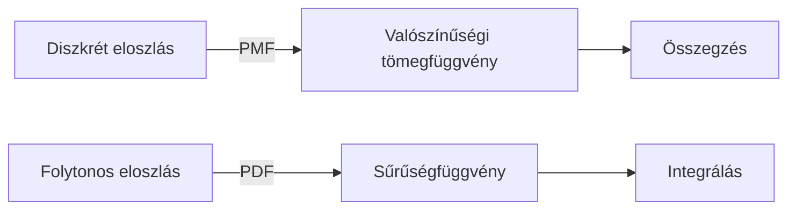
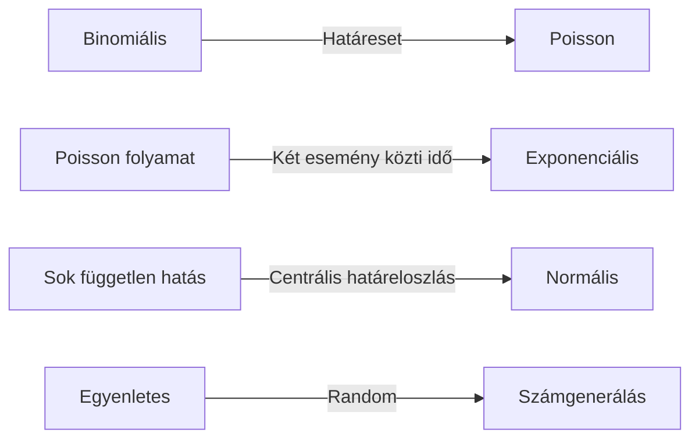

<div align="center">
	
</div>

---

<details>
<summary><b>📊 Diszkrét és folytonos valószínűségi eloszlás fogalma</b></summary>

| Fogalom | Leírás |
|---|---|
| **Diszkrét eloszlás** | Véletlen változó csak megszámlálhatóan sok értéket vehet fel (pl. dobókocka, hibák száma, ügyfélérkezések száma). |
| **Folytonos eloszlás** | Véletlen változó értékkészlete folytonos intervallum (pl. magasság, időtartam, hőmérséklet, pénzösszeg). |

**Diszkrét eloszlás jellemzői:**
- Valószínűségi tömegfüggvény (PMF): $P(X = x)$, minden lehetséges értékre.
- Összegzés: $\sum_{i} P(X = x_i) = 1$ (az összes lehetséges érték valószínűsége 1).
- Eloszlásfüggvény (CDF): $F(x) = P(X \leq x)$, lépcsős függvény.

**Folytonos eloszlás jellemzői:**
- Sűrűségfüggvény (PDF): $f(x)$, $P(a < X < b) = \int_a^b f(x) dx$.
- Integrálás: $\int_{-\infty}^{\infty} f(x) dx = 1$.
- Eloszlásfüggvény (CDF): $F(x) = \int_{-\infty}^x f(t) dt$, folytonos, sima függvény.

**Véletlen változó típusai:**
- Diszkrét: pl. dobókocka, hibák száma, ügyfélérkezések száma.
- Folytonos: pl. magasság, időtartam, hőmérséklet, pénzösszeg.

**Várható érték, szórás:**
- Diszkrét: $E[X] = \sum x_i P(X = x_i)$, $D[X] = \sum (x_i - E[X])^2 P(X = x_i)$
- Folytonos: $E[X] = \int_{-\infty}^{\infty} x f(x) dx$, $D[X] = \int_{-\infty}^{\infty} (x - E[X])^2 f(x) dx$

**Gyakorlati alkalmazás:**
- Diszkrét: minőségellenőrzés, hibák száma, ügyfélérkezések, készletkezelés.
- Folytonos: mérési hibák, időtartamok, fizikai mennyiségek, pénzügyi elemzés.

**Tipikus hibák:**
- Eloszlás típusának összekeverése (pl. folytonosra diszkrét képlet alkalmazása).
- Nem megfelelő paraméterek, hibás összegzés/integrálás.
- Eloszlásfüggvény és sűrűségfüggvény összekeverése.

**Best practice:**
- Mindig ellenőrizd, hogy a valószínűségek összege/integrálja 1.
- Válaszd ki a megfelelő eloszlást a modellezett jelenséghez.
- Dokumentáld a véletlen változó típusát, paramétereit.

**Vizsgatipp:**
- Rajzolj eloszlásgörbéket, magyarázd a várható értéket, szórást, mutasd be a CDF és PDF/PMF kapcsolatát.
- Hozz példát mindkét típusra, mutasd be a gyakorlati alkalmazást.
- Kérdés esetén mindig tisztázd, hogy diszkrét vagy folytonos eloszlásról van szó!

**Mermaid diagram:**


</details>

---

<details>
<summary><b>🎲 Nevezetes eloszlások: binomiális, Poisson, egyenletes, exponenciális, normális</b></summary>

| Eloszlás | Jellemzők | Paraméterek | Várható érték | Szórás | Példa |
|---|---|---|---|---|---|
| **Binomiális** | n független kísérlet, siker valószínűsége p | n, p | np | $\sqrt{np(1-p)}$ | Érmével dobás, hibás termékek száma |
| **Poisson** | Ritka események száma adott idő alatt | $\lambda$ | $\lambda$ | $\sqrt{\lambda}$ | Hívások száma, hibák száma időegység alatt |
| **Egyenletes** | Minden érték egyenlő valószínűségű | a, b | $(a+b)/2$ | $(b-a)/\sqrt{12}$ | Véletlen szám, sorsolás |
| **Exponenciális** | Két esemény közti idő | $\lambda$ | $1/\lambda$ | $1/\lambda$ | Géphiba idő, várakozási idő |
| **Normális** | Folytonos, haranggörbe, szimmetrikus | $\mu$, $\sigma$ | $\mu$ | $\sigma$ | Magasság, mérési hiba, IQ |

**Részletes leírások, képletek, tulajdonságok:**
- **Binomiális:**
  - $P(X = k) = \binom{n}{k} p^k (1-p)^{n-k}$
  - Diszkrét, két kimenet (siker/kudarc), Bernoulli próbák összege.
  - Alkalmazás: minőségellenőrzés, hibás termékek száma, szavazatok.
- **Poisson:**
  - $P(X = k) = \frac{\lambda^k e^{-\lambda}}{k!}$
  - Diszkrét, ritka események, nagy n, kicsi p határesete.
  - Alkalmazás: hívások száma, hibák, balesetek.
- **Egyenletes:**
  - Diszkrét: $P(X = x_i) = 1/N$ minden lehetséges értékre.
  - Folytonos: $f(x) = 1/(b-a)$, $a \leq x \leq b$.
  - Alkalmazás: sorsolás, random generálás.
- **Exponenciális:**
  - $f(x) = \lambda e^{-\lambda x}$, $x \geq 0$
  - Folytonos, események közti idő, memóriátlan tulajdonság.
  - Alkalmazás: hibák közti idő, várakozás.
- **Normális:**
  - $f(x) = \frac{1}{\sigma \sqrt{2\pi}} e^{-\frac{(x-\mu)^2}{2\sigma^2}}$
  - Folytonos, szimmetrikus, haranggörbe, 68-95-99.7% szabály.
  - Alkalmazás: magasság, IQ, mérési hibák.

**Kapcsolatok, összefüggések:**
- Binomiális határesete Poisson, ha n nagy, p kicsi, $np = \lambda$.
- Normális eloszlás: sok független hatás eredője (centrális határeloszlás tétel).
- Exponenciális eloszlás: Poisson folyamat két eseménye közti idő.

**Kódpéldák:**
```python
from scipy.stats import binom, poisson, uniform, expon, norm
# Binomiális
print(binom.pmf(6, 10, 0.5))
# Poisson
print(poisson.pmf(3, 5))
# Egyenletes
print(uniform.pdf(5, 1, 9))
# Exponenciális
print(expon.pdf(3, scale=0.5))
# Normális
print(norm.pdf(170, loc=175, scale=10))
```

**Tipikus hibák:**
- Paraméterek félreértése (pl. $\lambda$ jelentése Poissonban).
- Eloszlások összekeverése, nem megfelelő alkalmazás.
- Hibás várható érték, szórás számítás.

**Best practice:**
- Mindig ellenőrizd a paramétereket, értelmezd a modellezett jelenséget.
- Használj ábrákat, magyarázd a gyakorlati jelentőséget.
- Dokumentáld, hogy miért választottad az adott eloszlást.

**Vizsgatipp:**
- Rajzolj eloszlásgörbéket, magyarázd a várható értéket, szórást, mutasd be a gyakorlati alkalmazást.
- Hasonlítsd össze az eloszlásokat, mutasd be a kapcsolataikat.
- Kérdés esetén mindig mutass példát, és magyarázd el a képletet!

**Mermaid diagram:**


</details>

---

<details>
<summary><b>🧩 Adatszerkezetekkel kapcsolatos alapfogalmak: absztrakció, absztrakt adatszerkezetek</b></summary>

| Fogalom | Leírás |
|---|---|
| **Absztrakció** | Lényeges tulajdonságok kiemelése, részletek elrejtése |
| **Absztrakt adatszerkezet (ADT)** | Csak a rajta végezhető műveletek határoznak meg, implementáció elrejtve |

**Példa ADT-k:**
- Lista, verem, sor, halmaz

---
**Részletes magyarázat, elmélet, best practice, tipikus hibák, vizsgatippek, példák:**
- ADT: műveletek (pl. verem: push, pop), viselkedés, nem implementáció.
- Hibák: implementációs részletek keverése az absztrakcióval.
- Vizsgatipp: Mindig írd le a műveleteket, példákat adj.

</details>

---

<details>
<summary><b>🔢 Elemi adatszerkezetek: lista, verem, sor, halmaz, multihalmaz, tömb</b></summary>

| Adatszerkezet | Jellemzők | Műveletek | Példa |
|---|---|---|---|
| **Lista** | Rendezett elemek, tetszőleges módosítás | beszúrás, törlés, keresés | Láncolt lista |
| **Verem** | LIFO, utolsó elem jön ki | push, pop, peek | Függvényhívás |
| **Sor** | FIFO, első elem jön ki | enqueue, dequeue, front | Nyomtatási sor |
| **Halmaz** | Egyedi elemek, nincs sorrend | beszúrás, törlés, unió | Egyedi felhasználók |
| **Multihalmaz** | Többszörös előfordulás | beszúrás, törlés, darabszám | Szavak gyakorisága |
| **Tömb** | Fix méret, indexelt | indexelés, módosítás | Mátrix, vektor |

**Kódpélda veremhez:**
```python
class Stack:
    def __init__(self):
        self.items = []
    def push(self, item):
        self.items.append(item)
    def pop(self):
        return self.items.pop() if self.items else None
```
---
**Részletes magyarázat, elmélet, best practice, tipikus hibák, vizsgatippek, példák:**
- Lista: láncolt vagy tömbös, gyors keresés/módosítás.
- Verem: visszalépés, függvényhívás, undo.
- Sor: üzenetkezelés, processzor feladatok.
- Halmaz: egyediség, gyors keresés.
- Multihalmaz: gyakoriság, statisztika.
- Tömb: fix méret, gyors indexelés.
- Hibák: túlcsordulás, üres szerkezet, indexelési hiba.
- Vizsgatipp: Rajzolj szerkezeteket, magyarázd a műveleteket.

</details>

---

<details>
<summary><b>🌳 Fák ábrázolása, bejárások, keresés, beszúrás, törlés</b></summary>

| Fogalom | Leírás |
|---|---|
| **Fa** | Hierarchikus adatszerkezet, csomópontok és élek |
| **Gyökér** | Legfelső csomópont |
| **Levél** | Gyermek nélküli csomópont |
| **Magasság** | Gyökértől levélig vezető leghosszabb út |

**Ábrázolás:**
- Mutatós (pointeres), tömbös, szülőmutatós

**Bejárások:**
- Preorder: gyökér → bal → jobb
- Inorder: bal → gyökér → jobb
- Postorder: bal → jobb → gyökér
- Szélességi: szintenként, sorral

**Keresés, beszúrás, törlés bináris keresőfában:**
- Keresés: gyökértől indulva, balra vagy jobbra lépve
- Beszúrás: megfelelő helyre, hogy a rendezett tulajdonság megmaradjon
- Törlés: levél, egy gyermek, két gyermek esete

**Kódpélda inorder bejárásra:**
```python
def inorder(node):
    if node:
        inorder(node.left)
        print(node.value)
        inorder(node.right)
```

---
**Részletes magyarázat, elmélet, best practice, tipikus hibák, vizsgatippek, példák:**
- Fa: hierarchia, gyors keresés, rendezés.
- Bejárás: sorrend, feldolgozás.
- Hibák: mutatókezelés, üres fa, bejárás elrontása.
- Vizsgatipp: Rajzolj fát, mutasd be a bejárásokat, magyarázd a műveleteket.

</details>

---

<div align="center">
	
</div>